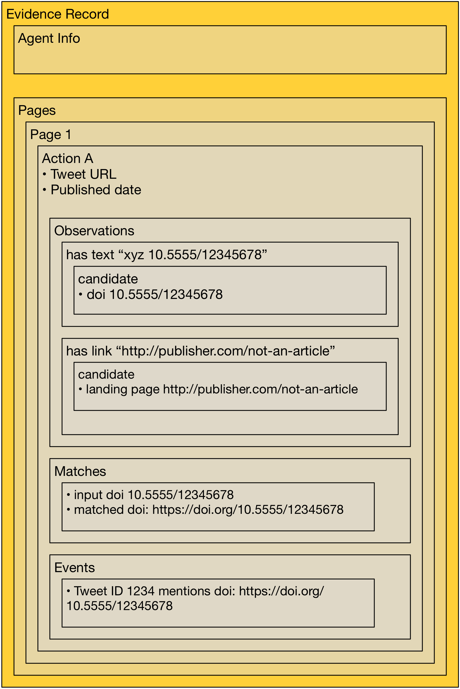
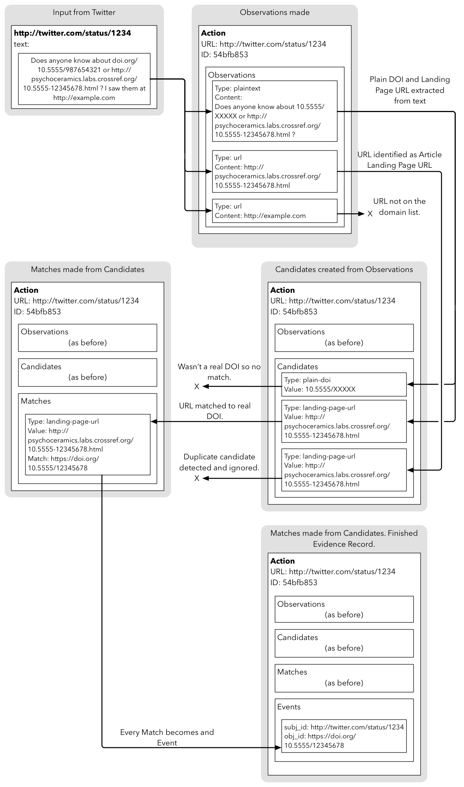

# Evidence Records

Evidence Records bridge the evidence gap between Events and the external data sources that supplied the data.

An Evidence Record generally corresponds to a single input or batch of inputs that came from an external API. For example:

 - There is one Evidence Record per domain query made against the Reddit API.
 - Tweets are collected into small batches, approximately 10 per Evidence Record.

An Evidence Record may correspond to one or more Events; one Event is linked to zero or one Evidence Records. Event Data may contain Events for which there is no Evidence, where the Event was provided by an external party. Likewise, if some data was processed and we could not extract Events from it, there will be an Evidence Record with no Events.

## Format of Evidence Records

An Evidence Record is a JSON document and it follows a core extensible format. When an Evidence Record is used to generate an Event, it contains **all** of the information used to create that Event.

Each Evidence Record comes from a single Agent, so it includes identifying fields:

 - `source-token`: a token that uniquely identifies the Agent
 - `source-id`: the source that identifies where the data ultimately came from
 - `agent`: supplementary information about the Agent, such as its version number and the Artifacts that it consumed to produce this Record

 An Evidence Record contains Actions. An example of an Action:

 - a comment was posted on Reddit
 - a Tweet was published
 - an edit was made to a Wikipedia page

An Action contains information about the thing that happened. This corresponds to the *Subject* of an Event. 

 - the URL of the Subject (comment, tweet or page)
 - the relation type that the subject has to anything that we found in it. E.g. a Wikipedia page always `references`, a Tweet always `discusses`
 - the time that the Action is reported to have occurred
 - metadata about the Subject, such as the title

### Observations

Each Action also comes with one or more Observations. Because there are a diverse range of types of input data in Event Data, different observations can be made. For example each of these is an Observation:

 - the text of a Tweet (which may contain plaintext DOIs)
 - the automatically extracted URLs from a Tweet (which could be DOIs or Article Landing pages)
 - the URL of a Blog Post from an RSS newsfeed (which must be visited to see the content of the blog post)

As you can see from the Tweet example, an it's possible to make different observations of different types about the same input. In some cases, such as Twitter, we do not have the permission to include the text, so it is removed before the Evidence Record is saved. In this case the `sensitive` flag on the Evidence Record is set to `true` and a SHA1 hash of the content is included. This means that if you want to verify the Evidence Record you can retrieve the Tweet text yourself and compare the hash. If the hash matches, you know you were working from the same input text as the Agent.

The following Observation types are available:

 - `plaintext` - some text that could contain plain-text DOIs, DOI URLs or Landing Page URLs
 - `html` - some HTML that could contain plain-text DOIs, DOI URLs or Landing Page URLs
 - `content-url` - the URL of a webpage that could point to a webpage that could contain plain-text DOIs, DOI URLs or Landing Page URLs
 - `url` - a URL that could itself be a DOI or Article Landing Page

### Deduplication and Action IDs

Every Action also has an ID, which is generated differently for each source. Action IDs are usually calculated from the URL of the object in question (Tweet URL, blog post URL etc).

If the same Action is reported twice (e.g. duplicate data is sent from the Twitter API, or two different RSS feeds link to the same blog post), the `duplicate` field will be set on the Action, showing a link to the previous Evidence Record where the action occurred. When a Duplicate Action happens, no Events are extracted.

Note that this is not a guarantee that the same 'thing' may be observed in different Events. It is possible that two Agents independently see the same thing and report on it. If, for example, a Reddit page appeared in an RSS feed, it might be picked up by both the Reddit and the Newsfeed agents, producing two Events. In each case, the Agent, source ID, and supporting Evidence Record would be different, and describe the process by which the Event came into being.

See [Duplication and Redundancy](/data/duplication) for further discussion.

### Observations to Candidates to Matches to Events

Each Observation may or may not ultimately yield Events. 

The First step is to create a set of Candidates for each Observation. For example some `plaintext` may contain something that looks like a DOI and something that looks like an article landing page URL. The webpage at the end of a `content-url` may contain something that looks like an Article Landing Page in the HTML of that page.

The set of available candidate types are:

 - `doi-url` - a full DOI URL
 - `pii` - a Publication Item Identifier
 - `plain-doi` - a text DOI like `10.5555/123456789`
 - `shortdoi-url` - a shortDOI like `http://doi.org/dvx`
 - `landing-page-url` - the URL of an Article Landing Page

The next step is to try and match every Candidate into a known DOI. It does this by trying to reverse the Landing Page back into a DOI, and by verifying that every DOI exists and cleaning it up.

Once Matches have been made, they are combined with the information in the Action (for example the subject ID and URL and any bibliographic metadata) to produce Events. When Events are successfully extracted, they are included along with the Action that gave rise to them. They are then sent through the Event Data system for you to consume.

Note that Events do not have a `terms` or `timestamp` field at this point - they are added at the next step of the journey. Also note that Events may be altered between the Evidence Record and the Query API, for example for compliance reasons. You should never take Events directly from Evidence Records, except for verifying the provenance trail.

### Page Structure

Actions are collected together into pages of lists. This model suits all Agents:

 - the Reddit API responds to a query with pages of results. Each API page corresponds to a page in the Evidence Record.
 - the Twitter agent always sends a single page containing a batch of Tweet Actions.

 

### Extras

Finally, there are always little bits of extra information that come from sources that it's useful to have. The Evidence Record, Page and Action objects can all have an `extra` field to accommodate these.

The Event Data Bot spends a lot of time visiting webpages on behalf of Event Data Agents. Every Evidence Record contains a log of all of the URLs that were visited, and the HTTP status codes that were received. If you see an inconsistency in the processing of an Event Record, you can look at the log to see if it was caused by an external URL timing out, blocking the agent etc.

### Journey

Every Evidence Record goes on a journey from from the initial input, created by the Agent, through to the finished item that you can get from the Registry.

## Example Evidence Record

Here is an example Evidence Record, adapted from [a real one in the API](https://evidence.eventdata.crossref.org/evidence/2017022284421dfd-ddbe-4730-bc35-caf11d92231f). As Evidence Records can be quite long, some lines were removed.

    
    {
      "source-token": "a6c9d511-9239-4de8-a266-b013f5bd8764",

The Crossref Reddit Agent identifies itself
      
      "extra": {
        "cutoff-date": "1948-09-12T16:14:51.795Z",
        "queried-domain": "www.ams.org"
      },
      
A bit of information about this Record specific to Reddit. It is looking for Events between now and 1948. This shows that it was performing a back-fill scan. Usually this will be a few hours into the past. It also shows that it was querying for the `www.ams.org` domain.
      
      "agent": {
        "version": "0.1.4",
        "artifacts": {
          "domain-set-artifact-version": "http://d1v52iseus4yyg.cloudfront.net/a/domain-list/versions/1487256359032"
        }
      },
      
The Agent also describes itself and tells us what version of the `domain-set` Artifact it was scanning through at the time. Looking at this, we know exactly which version of the list of domains it was working from.
      
      "pages": [

Previous pages have been snipped from this example.
      
        {
          "url": "https://oauth.reddit.com/domain/www.ams.org/new.json?sort=new&after=t3_3bgzfz",

This page was taken from this URL. Note that the `after` field, which is specific to the Reddit API, shows that we're mid pagination.
          
          "extra": {
            "after": "t3_4gcy84"
          },
          
The `after` field is included as a bit of extra information about this page.
          
          "actions": [
          
The list of Actions in this page corresponds to the list of items in the Reddit API response.

            {
              "occurred-at": "2011-01-12T06:07:04.000Z",

One Observation was made about this Action.

              "processed-observations": [
                {
                  "type": "url",
                  "input-url": "http://www.ams.org/journals/bull/2005-42-02/S0273-0979-05-01048-7/S0273-0979-05-01048-7.pdf",
                  
It turns out that the observation looks like a Landing Page URL, so one candidate is generated.

                  "candidates": [
                    {
                      "type": "landing-page-url",
                      "value": "http://www.ams.org/journals/bull/2005-42-02/S0273-0979-05-01048-7/S0273-0979-05-01048-7.pdf"
                    }
                  ]
                }
              ],
              "matches": [],
              
Sadly it was not possible to match any Candidates to DOIs.
              
              "events": [],
              
So no Events were generated this time. Better luck next time.
              
              "extra": {
                "subreddit": "puremathematics"
              },
              
Extra information about this Action is that it came from this subreddit.
              
              "id": "027d96141854aedb2ec0ac76d40f28b68d32b275",

The Action was given this ID, based on the ID of the Reddit conversation. If it is reported again, it will be marked as a duplicate.
              
              "url": "https://reddit.com/r/puremathematics/comments/f0qcn/immersion_theory_in_topology_pdf/",
              "subj": {
                "type": "post",
                "title": "Immersion Theory in Topology (pdf)",
                "issued": "2011-01-12T06:07:04.000Z"
              },
              
Extra information about the Reddit conversation.
              
              "relation-type-id": "discusses"
            },
            
Now we come to another Action. This time we were able to get Events!
            
            {
              "occurred-at": "2011-01-03T16:18:07.000Z",
              "processed-observations": [
                {
                  "type": "url",
                  "input-url": "http://www.ams.org/journals/bull/2008-45-04/S0273-0979-08-01223-8/home.html",
                  "candidates": [
                    {
                      "type": "landing-page-url",
                      "value": "http://www.ams.org/journals/bull/2008-45-04/S0273-0979-08-01223-8/home.html"
                    }
                  ]
                }
              ],

Another Article Landing Page URL observation, with a Candidate.

              "matches": [
                {
                  "type": "landing-page-url",
                  "value": "http://www.ams.org/journals/bull/2008-45-04/S0273-0979-08-01223-8/home.html",
                  "match": "https://doi.org/10.1090/s0273-0979-08-01223-8"
                }
              ],

The Agent was able to successfully match the candidate Article Landing Page to a DOI! Therefore the following Event was created.
              
              "events": [
                {
                  "obj_id": "https://doi.org/10.1090/s0273-0979-08-01223-8",
                  
The Object is the article being discussed.
                  
                  "source_token": "a6c9d511-9239-4de8-a266-b013f5bd8764",
        
The Source Token identifies the Agent.
                  
                  "occurred_at": "2011-01-03T16:18:07.000Z",
                  
The Subject was published at this time according to Reddit.

                  "subj_id": "https://reddit.com/r/math/comments/evgru/the_lord_of_the_numbers_atle_selberg_19172007_a/",
                  
The Subject is the Reddit comment at this URL.
                  
                  "id": "e5f8132e-9ae8-4fd9-ac61-56e47eff9fc2",
                  
The Event has a unique ID. This is different to the Action ID (after all, one Action could give rise to several Events).

                  "action": "add",
                  "subj": {
                    "pid": "https://reddit.com/r/math/comments/evgru/the_lord_of_the_numbers_atle_selberg_19172007_a/",
                    "type": "post",
                    "title": "The Lord of the Numbers, Atle Selberg (1917-2007).  A short description of his life and work and interview with the mathematical giant.",
                    "issued": "2011-01-03T16:18:07.000Z"
                  },

Subject metadata is included.

                  "source_id": "reddit",
                  "obj": {
                    "pid": "https://doi.org/10.1090/s0273-0979-08-01223-8",
                    "url": "http://www.ams.org/journals/bull/2008-45-04/S0273-0979-08-01223-8/home.html"
                  },
                  
Note that the Article is referred to by its DOI in the `obj_id` and `obj.pid` field (Persistent Identifier), as all pieces of Registered Content are in Event Data. However, the URL field demonstrates that we actually found a link to the Article via its landing page.
                  
                  "evidence-record": "https://evidence.eventdata.crossref.org/evidence/2017022284421dfd-ddbe-4730-bc35-caf11d92231f",
                  
The Event will have a link back to the Evidence Record (this document) so you can read all about its journey.
                  
                  "relation_type_id": "discusses"
                }
              ], 
              
Now we're back to the Action, including some of the data that went on to be included in the Event.
                           
              "extra": {
                "subreddit": "math"
              },
              "id": "24e85e455fbee43299a5d4a39f5106d1b1dfafb3",
              "url": "https://reddit.com/r/math/comments/evgru/the_lord_of_the_numbers_atle_selberg_19172007_a/",
              "subj": {
                "type": "post",
                "title": "The Lord of the Numbers, Atle Selberg (1917-2007).  A short description of his life and work and interview with the mathematical giant.",
                "issued": "2011-01-03T16:18:07.000Z"
              },
              "relation-type-id": "discusses"
            }
          ]
        }
      ],
      
The Percolator is the component that does the work of building the Evidence Record and extracting all the Events. You should treat it as 'part of the agent'. It is common to all Crossref Event Data Agents. Here it includes some data of its own: the version number of the Percolator software, and the version of the Artifact it used to convert article landing pages back to DOIs.
      
      "percolator": {
        "artifacts": {
          "domain-set-artifact-version": "http://d1v52iseus4yyg.cloudfront.net/a/crossref-domain-list/versions/1482489046417"
        },
        "software-version": "0.1.4"
      },
      "id": "2017022284421dfd-ddbe-4730-bc35-caf11d92231f",
      
The ID of this Action, for de-duplication purposes.
      
      "url": "https://evidence.eventdata.crossref.org/evidence/2017022284421dfd-ddbe-4730-bc35-caf11d92231f",
      
The URL where this Evidence Record will live.
      
      "source-id": "reddit",
    
Every URL visited in the process of building this Event.
      
      "web-trace": [
        {
          "url": "https://www.ams.org/open-math-notes?utm_content=bufferf6d9f&amp;utm_medium=social&amp;utm_source=facebook.com&amp;utm_campaign=buffer",
          "error": "unknown-error"
        },
        
This URL timed out, or the connection was reset.
        
        {
          "url": "http://www.ams.org/journals/bull/2008-45-04/S0273-0979-08-01223-8/home.html",
          "status": 200
        }

This one returned the `200 OK` status.
        
      ],
      "timestamp": "2017-02-22T16:17:17.582Z"
    }

## Getting Evidence Records

If an Event has an Evidence Record, it will be included in the `evidence_record` field. Follow this URL to retrieve the Evidence Record from the Evidence Registry.