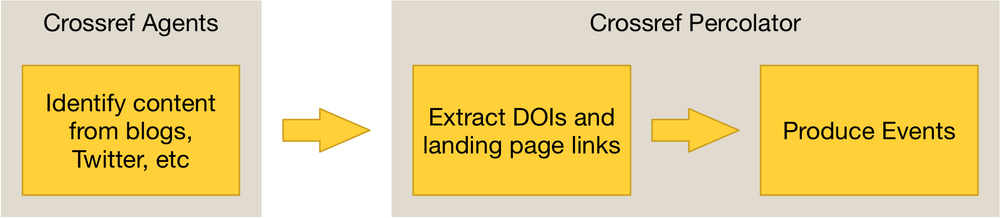
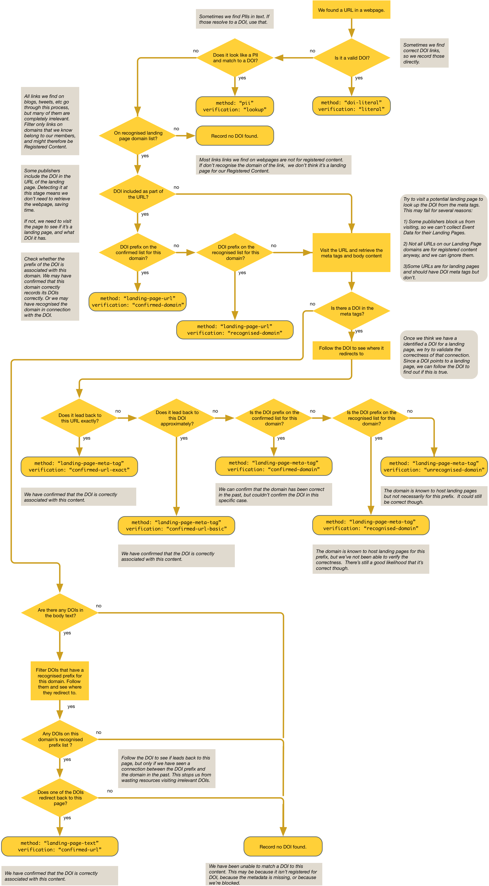

# How Crossref Agents match Landing Pages to DOIs

Crossref Agents gather data from exernal APIs, and where they spot a link to a URL to a potential Landing Page they pass it onto the Percolator. The Percolator follows a multi-step process to try and work out the DOI for the page and verify it as accurately as possible. The optional `obj.method` and `obj.verification` fields record which path was taken.

Because of the diversity of inputs we get and landing pages we find, this process will never be perfect. It is done on a best-effort basis, and we have a number of techniques for doing the match. The methods we use to extract the DOI and to verify the match range from broad to specific, and from highly accurate to less accurate. 

The detail on how the match was made and validated is included in Events (as of September 2018). You can choose which Events you want to use.

The process that we use for matching landing pages to DOIs is detailed in this flow chart, also [available as a PDF](../images/landing-page-flow.pdf):

# Understanding how an Event was created

Where relevant, you will see the `method` and `verification` in an Event's 'obj' metadata.

'Method' can be one of the following, in order of preference.

 - `pii` - The input was a PII ([Publisher Item Identifier](https://en.wikipedia.org/wiki/Publisher_Item_Identifier)). We used our own metadata to map this into a DOI.
 - `doi-literal` - The input was actually a DOI, no need to convert. This is most reliable.
 - `landing-page-url` - We looked at the URL and extracted the DOI directly. For example, PLOS URLs include the DOI as a URL parameter.
 - `landing-page-meta-tag` - We visited the webpage and found a meta tag, eg. `dc.identifier`, indicating the DOI.
 - `landing-page-page-text` - We visited the webpage and found a DOI in the body text and we think this is the DOI for this page. This is the least reliable.

When we match a landing page URL to a DOI, we attempt to verify the correctness of the match by comparing the two. This is indicated in the 'verification' field, which has one of the following values, again in order of preference:

 - `literal` - The URL is a DOI, so no need to validate. This is the most reliable.
 - `lookup` - We looked up the PII in our own metadata, and we trust that.
 - `checked-url-exact` - We visited the DOI and it led back to precisely the same URL. 
 - `checked-url-basic` - We visited the DOI and it led back to almost the same URL. The protocol (http vs https), query parameters or upper / lower case may be different. This can happen if tracking parameters are automatically added by the website meaning the URLs are no longer identical. 
 - `confirmed-domain-prefix` - On previous occasions we have seen that DOIs with the given prefix (e.g. "10.5555") redirect to webpages with the same domain (e.g. "www.example.com") and those websites correctly report their DOIs in meta tags. Only the domain and DOI prefix are considered.
 - `recognised-domain-prefix` - On previous occasions we have seen that DOIs with the given prefix (e.g. "10.5555") redirect to webpages with the same domain (e.g. "www.example.com"). Those websites do not always correctly report their DOIs in meta tags. Only the domain and DOI prefix are considered.
 - `recognised-domain` - On previous occasinos we have seen that this domain is associated with DOIs in general. This is the least reliable.

This level of detail and verification was introduced in version 0.6.2 of the Percolator in September 2018. Before this date you can assume that 'method' is one of:

 - `pii`
 - `doi-literal`
 - `landing-page-url`
 - `landing-page-meta-tag`

and 'verification' is `recognised-domain`.
