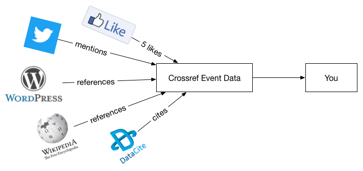
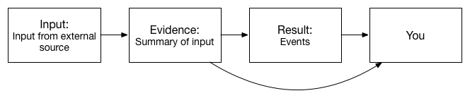

# Introduction

Crossref Event Data is a service for collecting Events that occur around Registered Content. For example, when datasets are linked to articles, articles are mentioned on social media or referenced online.

Much of the activity around scholarly content happens outside of the formal literature. This activity is of interest to a wide range people. Publishers may want to know how their articles are being shared, Authors might want to know when people are talking about their articles, Researchers may want to conduct bibliometrics research. And that's just for starters.

Crossref Event Data monitors and corrects links to scholarly content that we found out on the open web. It will serve as an open platform on which people can build tools, services and research. 

## Events

Every time we notice that there is a new relationship between a piece of Registered Content and something out in the web, we record that as an individual Event. We gather Events from a wide range of sources, but examples include:

 - an article was linked from DataCite dataset via its Crossref DOI
 - an article was referenced in Wikipedia using its Crossref DOI
 - an article was mentioned on Twitter using its Article Landing Page URL

In this example, a Tweet was published that mentions an Article 1, a blog post was published that referenced Articles 1 and 2, and a Wikipedia Article was published that referenced Article 2. That makes 4 events.

### Subject - relation - Object

An Event connects two 'things' with a particular relation type, like 'discusses'. One of those 'things' usually has a DOI. 

An Event reads like a sentence. A very simplified Event could read:

| Field         | Value | Reads |
|---------------|-------|-------|
| subject       | http://blog.example.com/1 | "The blog post with the URL http://blog.example.com/1 ..." |
| relation type | discusses | " ... discusses ... " |
| object        | https://doi.org/10.5555/123456789 | " ... the article with the DOI http://doi.org/10.5555/123456789 ... " |
| occurred at   | 2017-01-01 | "... on the 1st of January 2017 ..." |
| timestamp     | 2017-02-02 | "... and we first knew about it on the 2nd of January 2017." |

Events from every Data Source take many forms, but they have a common set of attributes:

 - the **subject** of the event, e.g. Wikipedia article on Fish
 - the **type of the relation**, e.g. "cites"
 - the **object** of the event, e.g. article with DOI 10.5555/12345678
 - the date and time that the event **occurred**
 - the date and time that the event was **collected and processed**
 - a **total** for when an Event has a quantity
 - optional **bibliographic metadata** about the **subject** (e.g. Wikipedia article title, author, publication date)
 - optional **bibliographic metadata** about the **object** (e.g. article title, author, publication date)

## Transparency and Data Quality

Data comes from a wide range of sources and each source is subject to different types of processing. Transparency of each piece of Event Data is crucial: *where* it came from, *why* it was selected, and *how* it was processed and by *whom*.

Every Event starts its journey somewhere, usually in an external source. Data from that external source is processed and analysed, and, if we're lucky, one or more Events are created. The entire process is transparent: what data we were working from, what we extracted and how, and how that relates to each Event. Nearly all Events that Crossref generates are linked back to an Evidence Record, which documents its journey.

Crossref Event Data was developed alongside the NISO recommendations for altmetrics Data Quality Code of Conduct, and we participated in the Data Quality working group. CED aims to be an example of openness and transparency. You can read the [CED Code of Conduct Self-Reporting table](app-niso.md) in the appendix.

## Accessing the Data 

Crossref Event Data is available via our Query API. The Query API allows you to make requests like:

 - give me all Events that were collected on 2016-12-08
 - give me all Events that occurred on 2015-12-08
 - give me all the Reddit Events that were collected on 2015-12-08
 - give me all the Events that occurred for this DOI on 2016-01-08
 - give me all the Twitter Events that occurred for this DOI on 2016-01-08

The Query API allows you to collect Event Data in bulk, and to check up to make sure you're up to date.

## Reliability and Monitoring

The Reports Service shows how each component in the system and each external source is functioning. CED integrates with a number of external Data Sources, and is transparent about how we interact with them.

## Interpretation

Interpretation is a significant theme in CED, and it's something you must think about when using the data. Every Event describes where it came from and who collected it. An Event can be interpreted several different ways. It's up to you to bear the origin and meaning of each Event in mind. This is discussed throughout the User Guide.

## Service Level Agreement

*This feature will be at a later date.*

We will introduce a Service Level Agreement which will provide agreed service levels for responsiveness of the service. It will also include APIs for access to data.
