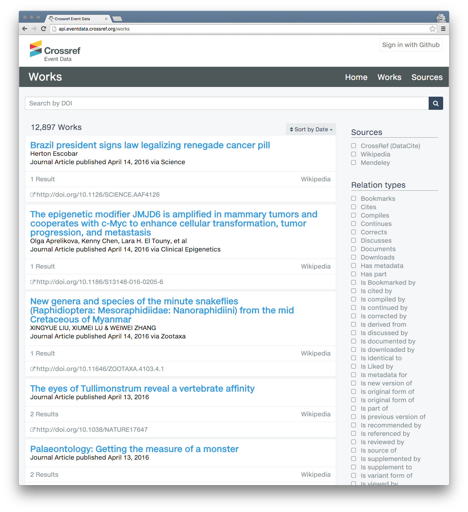
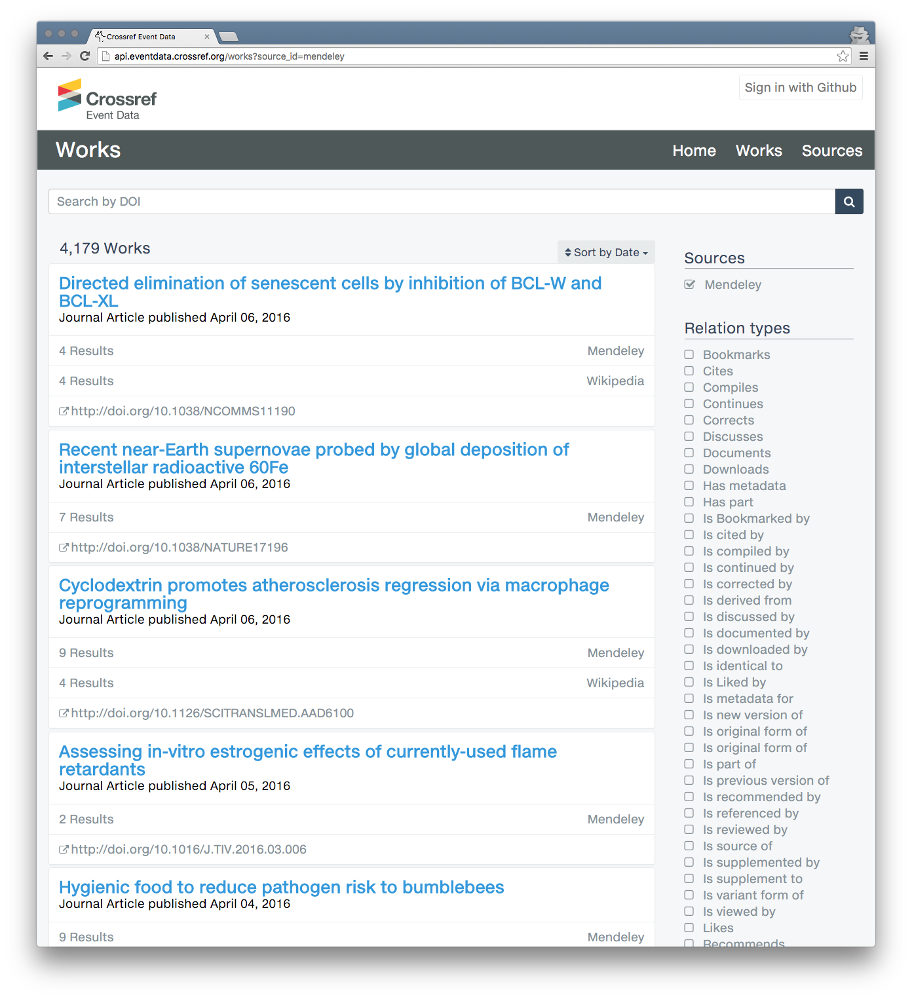
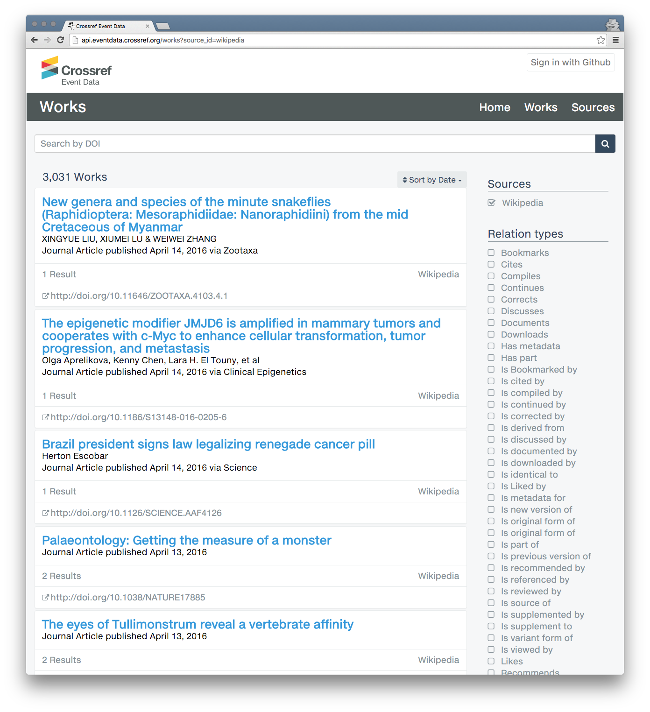
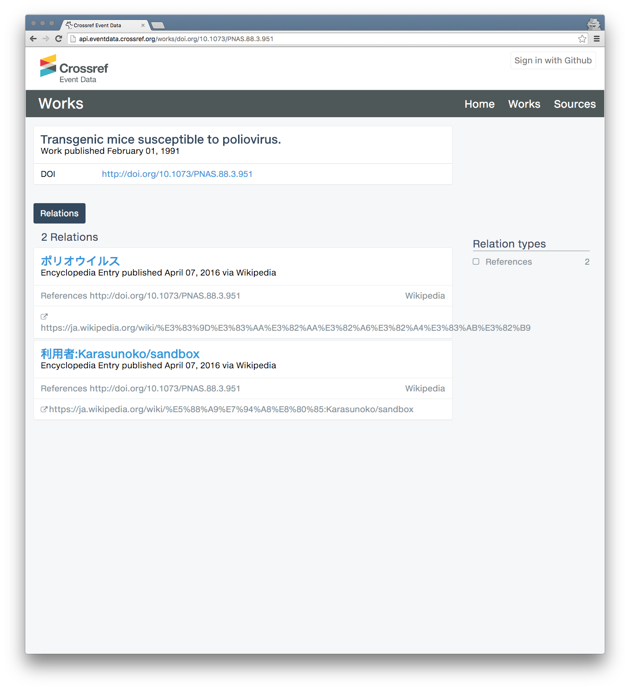
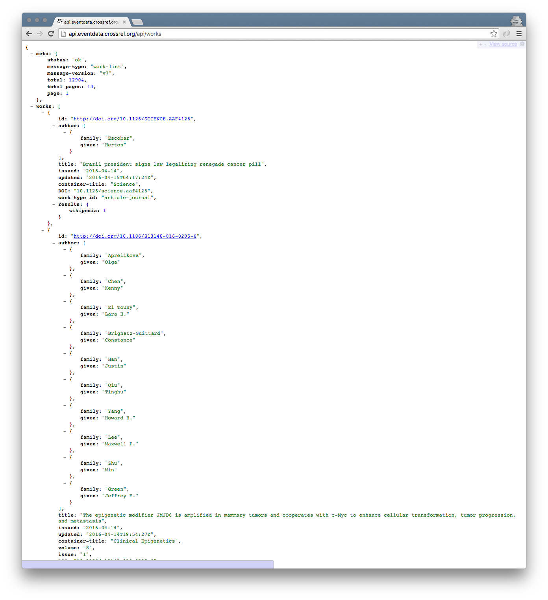
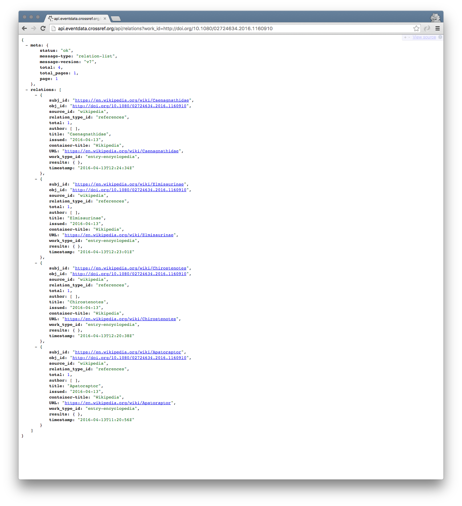
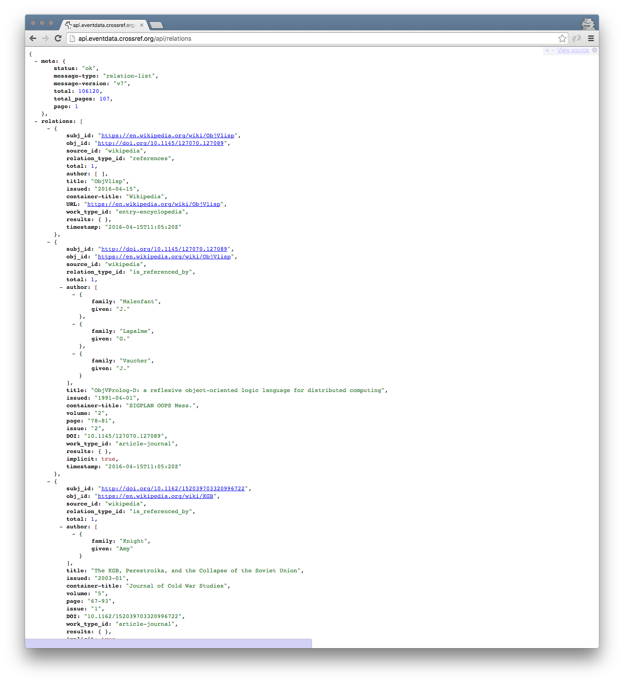
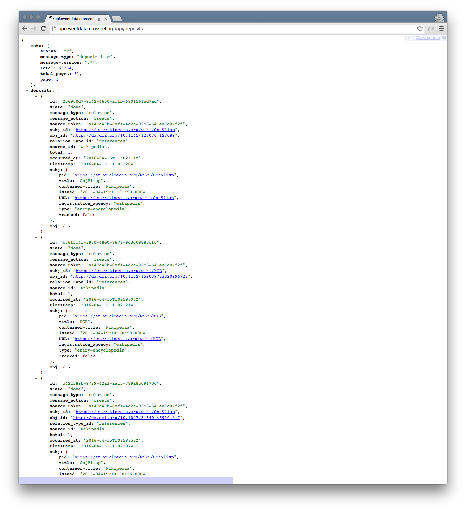

# Introduction {#introduction}

#ifdef __TODO__
---- ------------------------------------------------------------
Note WORK IN PROGRESS INCLUDES TODOS
------------------------------------------------------------------
#endif

#ifdef __FUTURE__
---- ------------------------------------------------------------
Note WORK IN PROGRESS INCLUDES FUTURE FEATURES
------------------------------------------------------------------
#endif

#ifdef __WIP__
---- ------------------------------------------------------------
Note Note that this document is a work in progress.
     For internal circulation only.
     Some parts may be missing and references may be made to non-existent sections.
------------------------------------------------------------------
#endif

Crossref Event Data (CED) is a service for collecting and distributing the events that occur around scholarly research objects. It concerns primarily articles in Crossref and datasets in DataCite that have a DOI. For the purposes of this document, 'Research Object' will be used to mean any item in Crossref (including articles, books, conference proceedings, etc) or in DataCite (including datasets etc) that has a DOI. 

CED is currently at Minimum Viable Product (MVP) stage. MVP means that we have put the pieces in place to demonstrate that we can collect and disseminate Event Data, but **it is not offered as a complete or production-quality service**.

This manual may refer to future cabpilities of Crossref Event Data in order to illustrate principles. Crossref Event Data and this manual are constantly evolving. **For more information about Crossref Event Data, and the most up to date version of this User Manual, see [http://eventdata.crossref.org](http://eventdata.crossref.org)**.

Much of the web activity around scholarly content happens outside of the formal literature. The scholarly community needs an infrastructure that collects, stores, and openly makes available these interactions. That’s why we at Crossref are working to develop a new service that will provide a means of monitoring and displaying links to scholarly content on the open web. Our belief is that the greater visibility provided by Crossref Event Data will help publishers, authors, bibliometricians and libraries to develop a fuller understanding of where and how scholarly content is being shared and consumed.

We believe that by developing all of our software as open source, and by making our processes and data transparent, Event Data will be as trustworthy and understandable as possible. 

While Event Data does collect and aggregate data, there will be a clear audit trail for how every figure is produced.

#ifdef __FUTURE__

## NISO

Crossref Event Data was developed alongside the National Information Standards Organisation (NISO) Altmetrics Data Quality Code of Conduct and Crossref participated in the working group to form the recommendations. CED aims to follow all of the recommendations.

[Appendix: NISO Altmetrics Data Quality Code of Conduct](#niso-appendix) answers every point in the Code of Conduct, making reference to detail in this manual. See also the ["Definitions and Use Cases"](http://www.niso.org/apps/group_public/download.php/16268/NISO%20RP-25-201x-1%2C%20Altmetrics%20Definitions%20and%20Use%20Cases%20-%20draft%20for%20public%20comment.pdf) document.

For the purposes of NISO compliance, Crossref Event Data serves both as an 'altmetric data provider' in that it generates some Event Data (e.g. the 'Crossref Related' Data Source) and an 'altmetric data aggreator' in that it collects, processea and makes available Event Data through its APIs.

The current status of the NISO Code of Conduct is *Draft for Public Comment* and you can find more information on the [NISO Altmetrics Initiative site](http://www.niso.org/topics/tl/altmetrics_initiative). See the [Roadmap](#roadmap) section for details on when CED will be compliant.

#endif

## What is an Event? {#what-is-event}

The world of Event Data is varied, and CED aims to capture data from as wide a range of Data Sources as possible. An event can be described as

> an action that occurs concerning a Research Object that has a DOI

However the types of events that occur are varied. Here are some examples:

- someone tweeted mentioning a DOI
- someone liked an article on Facebook
- a reference to an article was added to Wikipedia using its DOI

Data is collected from a range of services and the information we have access to is as varied as the types of events that occur

 - we can capture and represent an individual tweet that mentions a DOI on Twitter
 - Facebook only gives us access to a count of how many times a DOI has been liked at a given point in time
 - Wikipedia poses an interesting challenge because a reference can be added or removed, so depending when you query the system, a reference may or may not exist

There are also different types of data consumers who want to see different levels of detail:

- an author wants to know if article was mentioned on Twitter
- a bibliometrician wants to know what time of day people tweet about DOIs
- a Wikipedian wants to know how often DOI references are removed from articles

For this reason, we represent Events in two layers: Relations and Deposits.

## Relations

A Relation is a single piece of information that concerns a research object. Examples include:

- `twitter.com/CrossrefOrg/status/517313741491552256` mentioned `doi.org/10.5555/12345678` on 12th November 2014.
- On Facebook, the DOI `doi.org/10.1016/0300-9629(73)90490-8` was liked 5 times as of 25 November 2016.
- `en.wikipedia.org/wiki/Fish` references `doi.org/10.1007%2Fs003600050092` as of 24 September 2015.

These Relations resemble triples, but include a date stamp and an optional count. For some Data Sources, such as Twitter, they represent individual events that happened at a point in time. For some Data Sources, such as Facebook, they represent a count of events at a point in time without any further detail because that is what is available. 

For some Data Sources where numbers can go up and down (e.g. Facebook), or where references can be added or removed (e.g. Wikipedia), they represent the current snapshot.

### Inverse Relations {#inverse-relations}

Every Relation type has an inverse. For example `X cites Y` has the inverse `Y is cited by X`. When a Relation is put into CED its inverse Relation is also created automatically. Thus most Events correspond to two Relations. You can see all of the [relations and their inverse in the source code](https://github.com/lagotto/lagotto/blob/master/db/seeds/production/relation_types.yml), although not all are used.

## Deposits

Relations aren't able to represent all activity. A Deposit is a single data point that records when CED became aware of new information. Examples of Deposits are:

- On 12th November 2014, Twitter reported that `twitter.com/CrossrefOrg/status/517313741491552256` was published and it mentioned `doi.org/10.5555/12345678`.
- On 26th November 2016, CED contacted Facebook, and Facebook reported that
    `doi.org/10.1016/0300-9629(73)90490-8` currently had 5 likes.
- On 24th September 2015, Wikipedia reported that there was an edit to the `en.wikipedia.org/wiki/Fish` in which a reference to `doi.org/10.1007%2Fs003600050092` was removed.

## Working with Events

For most tasks, Relations are useful. They help you to answer questions like "when was this DOI tweeted?" or "is this DOI mentioned in Wikipedia?". 

When it is important to get more detail on what exactly occurred to produce a Relation, Deposits will provide it. For example, they can help you to answer questions like "was this DOI reference removed from Wikipedia repeatedly?". It can also answer questions like "when exactly in the past has CED queried Facebook about this DOI".

#ifdef __FUTURE__

# Roadmap

Crossref Event Data is currently at MVP stage, which is a proof of concept with a limited number of Data Sources. As we move toward a full 'Clearinghouse' release more Data Sources, partners and methods for accessing data will be added.

The approximate roadmap is:

- 0.1 - **MVP** - Minimum Viable Product.
- 1.0 - **Audit** - Stable system with full audit capability and compliance with NISO Code of Conduct.
- 2.0 - **Clearinghouse** - Launch with complete feature set.
- 3.0 - **SLA** - Service Level Agreements available.

## Available Data Sources

See the [Data Sources](#sources) section for a list of currently available Data Sources. Future Data Sources may include:

| Blogs & Reference Works | Social Bookmarks | Social Shares & Discussions | Links to Research Entities |
|-------------------------|------------------|-----------------------------|----------------------------|
| Research Blogging       | CiteULike        | Facebook                    | ORCiD                      |
| ScienceSeeker           | Mendeley         | Twitter                     | DataCite                   |
| Wikipedia               | Reddit           | Europe PMC                  | Database Citations         |
| Wordpress.com           |

## Service Level Agreements

Crossref Event Data will provide Service Level Agreements to partners. This will provide an agreed level of service availability for access to the API. It will provide exactly the same data, but from dedicated servers that give predictable performance.

Please contact Crossref if you are interested on eventdata@crossref.org.

## Access to Data

At MVP stage access to data is via the APIs and the user interface that is built into the Lagotto software. At a future point Crossref may integrate some information into its user interfaces.

#endif

# Quick start

You can access data through the user interface or the API. Here are some examples to get you started.

## User interface

### Browse all of the available Research Objects. 

[http://api.eventdata.crossref.org/works](http://api.eventdata.crossref.org/works)

{.img-responsive}

In this example, these DOIs have been cited in Wikipedia articles. You can click on the titles to view full information on the article and the Relations that show which Wikipedia articles reference it.

### Browse all Research Objects for which there were events on Mendeley:

[http://api.eventdata.crossref.org/works?source_id=mendeley](http://api.eventdata.crossref.org/works?source_id=mendeley)

{.img-responsive}

Here we see articles that have been bookmarked with Mendeley, and how many times they were bookmarked. 

### Browse all Research Objects for which there were events on Wikipedia

[http://api.eventdata.crossref.org/works?source_id=wikipedia](http://api.eventdata.crossref.org/works?source_id=wikipedia)

Here we see articles that have been referenced on Wikipedia. Note that some cases, articles are cited by more than one article. Sometimes this is because an article on one topic is translated into several different languages, somtimes several different articles will cite the same article.

{.img-responsive}

### View all of the Relations for the DOI `10.1073/PNAS.88.3.951`

[http://api.eventdata.crossref.org/works/doi.org/10.1073/PNAS.88.3.951](http://api.eventdata.crossref.org/works/doi.org/10.1073/PNAS.88.3.951)

{.img-responsive}

## API

The API provides bulk access to Relations and Deposits. You can access it in your browser, use tools like [cURL](https://curl.haxx.se/) or integrate it with your software.

If you're using Chrome, we suggest you use JSONView (available for [Chrome](https://chrome.google.com/webstore/detail/jsonview/chklaanhfefbnpoihckbnefhakgolnmc) and [Firefox](https://addons.mozilla.org/en-us/firefox/addon/jsonview/)) to make it easier to read the output.

### Browse all of the available Research Objects known to CED. 

[http://api.eventdata.crossref.org/api/works](http://api.eventdata.crossref.org/api/works)

{.img-responsive}

### View all of the Relations for the DOI `10.1080/02724634.2016.1160910`

[http://api.eventdata.crossref.org/api/relations?work_id=http://doi.org/10.1080/02724634.2016.1160910](http://api.eventdata.crossref.org/api/relations?work_id=http://doi.org/10.1080/02724634.2016.1160910)

{.img-responsive}

### View all of the Relations in CED

[http://api.eventdata.crossref.org/api/relations](http://api.eventdata.crossref.org/api/relations)

{.img-responsive}

### View all of the Deposits in CED

[http://api.eventdata.crossref.org/api/deposits](http://api.eventdata.crossref.org/api/deposits)

{.img-responsive}

Note that when you browse the Deposits API you will see live Deposits as they occur. Look at the `state` to see whether or not they have been processed yet.

# Using the API

The API is free to use without restrictions. At MVP stage it contains only small but growing sample of Event Data. While the API does provide search functionality, you may not yet find the DOI you are looking for.

**The [API is documented using Swagger](http://api.eventdata.crossref.org/api)**. where you can find detailed information on all of the options available. What follows here is a conceptual explanation of the CED API.

## Events, Deposits & Relations

As detailed in the [What is an Event](#what-is-an-event) section, Event Data is represented as Relations and Deposits. These are available on the Event Data API. The API is web-based and uses JSON so you can easily develop software to work with it or try it out in your browser.

### Deposit API

The Deposit API provides access to recent Deposits. It is available at `http://eventdata.crossref.org/api/deposits`.

Query parameters for filtering Deposits:

- `message_type` - `create` or `delete`
- `source_token` - the source token ID of the service that pushed the data in (see [Source Tokens](#source-tokens-appendix))
- `state` - the state of the deposit: one of `waiting`, `working`, `failed`, `done`
- `page` - the page number

Most deposits are of `create` type. For Data Sources such as Wikipedia, where references can be removed, the type of a deposit might be `delete`.

Example queries:

Show only Deposits form the Wikipedia Data Source:

`http://eventdata.crossref.org/api/deposits?source_token=a147a49b-8ef1-4d2a-92b3-541ee7c87f2f`

Show only Deposits that involve removing a Relation:

`http://eventdata.crossref.org/api/deposits?message_type=delete`

An example response from the Deposit API:

    {
      meta: {
        status: "ok",
        message-type: "deposit-list",
        message-version: "6.0.0",
        total: 1,
        total_pages: 1,
        page: 1
      },
      deposits: [
      {
        id: "cd6e55aa-b03c-494a-909d-2f1f707d489b",
        state: "done",
        message_type: "relation",
        message_action: "create",
        source_token: "a147a49b-8ef1-4d2a-92b3-541ee7c87f2f",
        subj_id: "https://en.wikipedia.org/wiki/Xorphanol",
        obj_id: "http://dx.doi.org/10.1111/j.1749-6632.1988.tb38614.x",
        relation_type_id: "references",
        source_id: "wikipedia",
        total: 1,
        occurred_at: "2016-03-22T12:10:19Z",
        timestamp: "2016-03-22T13:17:04Z",
        subj: {
          pid: "https://en.wikipedia.org/wiki/Xorphanol",
          title: "Xorphanol",
          container-title: "Wikipedia",
          issued: "2016-03-21T18:59:05.000Z",
          URL: "https://en.wikipedia.org/wiki/Xorphanol",
          registration_agency: "wikipedia",
          type: "entry-encyclopedia",
          tracked: false
        },
        obj: { }
      }
      ]
    }

An explanation of the pertinent parts:

    deposits: [

The list of Deposits follows. You can use the `page` parameter to page through the results. Our example has only one Deposit.

    state: "done",

When a Deposit enters CED its status is `waiting`. It will then be processed, at which point its status will be `working` and then it will be either `done` or `failed` if there was a problem processing it. When a Deposit is in the `done` state it will have created, updated or deleted one or more Relations.

    source_token: "a147a49b-8ef1-4d2a-92b3-541ee7c87f2f",

Every Data Source has a token to identify it. You can use this to query the Deposit API for events that came from a particular sources. See the [Source Tokens](#source-tokens-appendix) section for the list of available sources.

    subj_id: "https://en.wikipedia.org/wiki/Xorphanol",

The Subject of the event. In this case it is the English Wikipedia article 'Xorphanol', but it could be a tweet.

    obj_id: "http://dx.doi.org/10.1111/j.1749-6632.1988.tb38614.x",

The Object of the event, usually a DOI.

    relation_type_id: "references",

The type of the Relation being recorded. Other values are 'cites', 'mentions', 'likes' etc.

    total: 1,

The number of actions this represents. For most data this will be 1, but for Data Sources like Facebook, which represents only 'the number of times a DOI is currently liked', this can have other values.

    occurred_at: "2016-03-22T12:10:19Z",

The agent that collects this data records the time as soon as it collects the event. In this example, there was an edit to Wikipedia at 12:10.

    timestamp: "2016-03-22T13:17:04Z",

CED records the time as soon as it recieves the event. In this example, the deposit was made at 13:17, meaning the Wikipedia Data Source took 1 hour and 7 minutes to process the event. Note that the `timestamp` can be considerably different to the `occurred_at` if, for example, back-files are re-analyzed to extract new data. If you are performing analysis remember to bear in mind the difference between when the event occurred and when CED became aware of it.

    subj: {
      pid: "https://en.wikipedia.org/wiki/Xorphanol",
      title: "Xorphanol",
      container-title: "Wikipedia",
      issued: "2016-03-21T18:59:05.000Z",
      URL: "https://en.wikipedia.org/wiki/Xorphanol",
      registration_agency: "wikipedia",
      type: "entry-encyclopedia",
      tracked: false
    },

The Wikipedia Data Source includes information about the subject, in this case the Wikipedia article so CED can provide basic information about it.

    obj: { }

Sources can also include metadata information about the object, in this case a DOI, but CED automatically gathers this information.

### Relations API

The Relations API provides access to all of the Relations in CED. It is available at `http://eventdata.crossref.org/api/relations`.

Query parameters for filtering Relations:

- `work_id` - The ID of the work, e.g. `http://doi.org/10.5555/12345678`
- `work_ids` - Comma separated work IDs
- `relation_type_id` - Relation type, e.g. `cites`
- `source_id` - ID of the Data Source, e.g. `wikipedia`
- `page` - Page number
- `recent` - Limit to relations created last x days
- `per_page` - Results per page (0-1000), defaults to 1000

Here is an example API response.

    {
      meta: {
        status: "ok",
        message-type: "relation-list",
        message-version: "v7",
        total: 2,
        total_pages: 1,
        page: 1
      },
      relations: [{
        subj_id: "https://en.wikipedia.org/wiki/Red_giant",
        obj_id: "http://doi.org/10.1086/306546",
        source_id: "wikipedia",
        relation_type_id: "references",
        total: 1,
        author: [ ],
        title: "Red giant",
        issued: {date-parts: [[2016,3,31]]},
        container-title: "Wikipedia",
        URL: "https://en.wikipedia.org/wiki/Red_giant",
        work_type_id: "entry-encyclopedia",
        events: { },
        timestamp: "2016-03-31T14:46:11Z"
      },
      {
        subj_id: "http://doi.org/10.1086/306546",
        obj_id: "https://en.wikipedia.org/wiki/Red_giant",
        source_id: "wikipedia",
        relation_type_id: "is_referenced_by",
        total: 1,
        author: [{family: "Boothroyd", given: "Arnold I."},
                 {family: "Sackmann", given: "I.-Juliana"}],
        title: "The CNO Isotopes: Deep Circulation in Red Giants and First and Second Dredge-up",
        issued: {date-parts: [[1999,1]]},
        container-title: "ApJ",
        volume: "510",
        page: "232-250",
        issue: "1",
        DOI: "10.1086/306546",
        URL: "http://dx.doi.org/10.1086/306546",
        work_type_id: "article-journal",
        events: { },
        timestamp: "2016-03-31T14:46:11Z"}]
    }

The Subject and Objects are referred to by their canonical URLs. Notice that a single Deposit with a `references` relation type has created two Relations: one with a `references` and an automatic inverse `is_referenced_by` (see [Inverse Relations](#inverse-relations)). The metadata provided corresponds to the Subject of the Relation in each case.

 #ifdef __TODO__

TODO

- example query
- example response and docs
- doesn't contain all deposits - see [Availability](#availability)
- swagger docs

#endif

## Deleted data

Relations can be deleted. For example, when a reference from a Wikipedia article to a DOI is removed, that reference no longer exists. CED aims to always have the most up-to-date state as far as possible.

When a Relation is deleted, it will be because of a particular Deposit which included an instruction to delete it. All Deposit events are retained in the Deposit API and log, so no information is lost. If you are interested in, for example, Wikipedia deletions, can find every addition and deletion of a reference in the Deposits.

## Cache and Processing Delays

Some data is cached, which means the API might not reflect the most recent data in CED. 

When a Deposit enters CED there may be a short delay before it is processed to update the Relations information. This will be at least 5 minutes, but at times of heavy traffic this may increase. You can check the status of Deposits by using the Deposit API.

#ifdef __TODO__
Data will never be older than TODO.
#endif

## Availability {#availability}

All of the data is open for anyone to use. We will try to ensure that the Relations and Deposit APIs are available to all. As we are providing this as a free-to-access service, high demand may produce occasional fluctuations in service. We are planning to introduce a paid-for Sevice Level Agreement (SLA), which will provide agreements about the availability of the service. They will provide exatly the same data.

All Relations in CED will be available via the Relations API, and once a Relation is in CED, it will always be available in its most up-to-date form on the API unless it is deleted. For practical reasons due to the high volume of data, the Deposits are *not* guaranteed to be available on the Deposits API forever. Deposits will be archived after a certain period of time so data will never be lost or become unavailable. 

#ifdef __FUTURE__

The exact period of time before Deposits are archived to the Deposit Log are to be determined, based on real-world observations. See the [Audit and Reproducibility](#audit-reproducibility) section for how to access old deposits.

#endif

# Scope {#scope}	

Crossref Event Data collects Event Data on Research Objects that have Crossref or DataCite DOIs. It does this by monitoring various services for references to those Research Objects.

## DOIs vs Landing Pages {#landing-pages}

All of the Research Objects that Crossref Event Data tracks have DOIs. However not every website and service we're interested in tracking uses them. As every DOI resolves to a landing page, some services follow the link before recording it and some use the DOI directly. 

CED tracks Research Objects using the most suitable URL. For some, like Wikipedia, this will be the DOI. For others, such as Facebook, this will be the landing page URL.

CED therefore monitors certain Data Sources for article landing pages and attempts to deduce the DOI from the landing page URL. For details on the methodology see the [Landing Page Reversal](#reversal) section.

A different approach is suitable for each Data Source, so please see each Data Source's documentation for full details.

## Other DOI Registration Agencies 

CED accepts any DOI so, whilst nearly every DOI in CED will belong to either Crossref or DataCite, it is possible that DOIs from another Registration Agency (RA) will be found in CED.

## Internal Research Object list {#internal-research-object-list}

CED stores a list of Research Objects. Every time CED becomes aware of a new Research Object, for example via a Data Source, it is added to the list. It would not be practical to store details of every single Research Object in existence (approximately 80 million) when the majority have no events. CED only stores Research Objects that it thinks are likely to have event data. The aim is that most Research Objects in CED have at least one Relation.

For pull sources, such as Facebook, CED can only retrieve data for Research Objects it knows about via the internal Research Object list. It would be practically impossible to poll the Facebook API for 80 million Research Objects. Thus CED will only check for Facebook events on Research Objects that been added to CED through some other push source (such as Wikipedia). Whilst this does mean that CED doesn't check Facebook for every Research Object in existence, it does mean that there is a higher probablility that the Research Objects it *does* check do have some data. Check the documentation for each Source for full details.

Every Research Object in CED has a timestamp so you can check when CED first became aware of it.

This means that some events may not be captured because CED doesn't know about, and therefore can't query for, the DOI. It also means that even if there is some event data for a given Research Object, it only goes as far back as the time when CED became aware of it.

#ifdef __FUTURE__

# Landing Page Reversal

We use the most suitable approach for each Data Source to ensure we get the most complete data. Refer to the documentation for each Data Source for details of the method used and the .

TODO FINISH

The methodology and limitations are detailed in the [Reversal](#reversal) section.

## Methodology

TODO

- how are domains collected / filtered
- list methods

## Limitations

TODO

- does not hit all landing pages, but nearly all known ones
- not all landing pages can be followed
- not possible to reverse all URLs
- some publishers prevent it
- show data for proportion of tweets collected
- domains from sample of DOIs per publisher

## Auditability 

TODO

- snapshots freely available, provide details
- versioning policy
- contents of snapshot
- source code available
- correlation to deposits
- see sources for their own audit log format

# Audit & Reproducibility {#audit-reproducibility}

TODO
 - Crossref Event Data is completely transparent
 - Provide Relations, Deposits and Audit Logs
 - Recreate Relations from Deposits
 - Recreate Deposits from 
 

## Three levels of data

TODO

- relations
- deposits
- audit logs

#### Deposits 

TODO

- evidence for deposits - bibliometricians

#### Per source audit

If you want access to the audit logs for given sources, please contact Crossref. For contractual reasons, access to some data is subject to restrictions.

TODO

- limitations e.g. API keys, requests, removing sensitive info
- not available at MVP technical challenges

## DOI Reversal service {#reversal}

TODO

- see chapter

### Known research objects

TODO

- timestamp avilable for all Research Objects useful for knowing when a DOI might have first been queried against.

## Software

All the software involved in running Crossref Event Data is open source and available to the public. Crossref will publish a detailed log of every piece of software that is running at what version and update it when the new versions are deployed. This will allow auditors to know precisely which combinations of software were running at a given point in time.

## Upstream services

TODO

- will attempt to draw attention to interruptions to upstream services, but no commitment to rigorous interpretation

## audits.eventdata.crossref.org

TODO

 - version numbers and reversal datasets

#endif

# Data Sources {#sources}

The following Event Data Sources are available:

- Wikipedia
- Crossref to Datacite
- Datacite to Crossref
- Mendeley
#ifdef __FUTURE__
- Twitter
- DataCite Related
- Facebook

#endif

Full details of each Data Source are provided below.

## Push vs Pull {#push-vs-pull}

Every Source operates by communicating with an external service via its API to retrieve information. Data Sources are divided into those where the external service is able to send data directly to CED ('Push Sources') and those that require CED to initiate a request ('Pull Sources'). 

Pull sources, for example Facebook, provide some kind of interface that CED must go out and query. Most sources require one request to be made for each DOI we are interested in. Because of this, the data that we have for a pull source is only as recent as the last time we checked against it.

Because of techincal limitations like bandwidth, external organisations imposing rate limits on their APIs, and because there are around 80 million DOIs in existence, we cannot check every DOI against every Pull Source and we are limited in how often we can make queries.

CED will aim to update data from pull sources as often as possible, but this will fluctuate depending on real-world observations.

Push sources, for example Wikipedia, are able to send data directly to CED. This means that there are no limitations on the selection of DOIs (a Push source can send data about any DOI at any time) and it means that the data can be much fresher. Some push sources send data live as it is happening (e.g. Wikipedia), although it is up to the push source how often it pushes data. Some push sources may push data in batches. See the documentation for each source for details.

## Selection of DOIs for Pull Sources {#selection-of-dois}

Pull Sources work by making a query against an external service for a given Research Object's DOI. To do this, it maintains an internal list of Research Objects. The [Scope](#scope) section gives full details.

## Data Sources, Agents and Source tokens

A Data Source describes the type of data or where it came from. Examples of Data Sources are Wikipedia or Mendeley. For each source, a piece of software called an Agent runs to collect the data and put it into CED. There is usually one Agent for each Data Source.

Every source is identified by a name, for example `mendeley` or `wikipedia`. You can use these to filter Relations and Deposits. Every Agent has its own Source token, for example `a147a49b-8ef1-4d2a-92b3-541ee7c87f2f`, and this identifies a particular piece of software running on a particular server. You can use this to filter Deposits or to help trace the path of data through the system. See see the [Source Tokens Appendix](#source-tokens-appendix) for a full list of currently operating Agents and their Source Tokens.

All of the Pull Sources are operated by Crossref, but the Push Sources could in theory be run by anyone — Crossref, DataCite or a third party.

## List of Data Sources

### Datacite to Crossref

Data citations in the form of links to Crossref DOIs from DataCite DOIs. The links are deposited in dataset metadata by dataset publishers. Agent operated by DataCite.

#### What events look like

Every citation from a DataCite DOI to a Crossref DOI produces a `cites` relation.

#### Provenance

Links are deposited with DataCite by DataCite members as part of the work metadata. 

#### Methodology

Metadata deposits are processed by the DataCite system and made available on the DataCite API. DataCite operates an agent that extracts deposits and sends them to CED.

#### Coverage

All DataCite DOIs are covered.

#### Freshness

DataCite will push data on a regular schedule, approximately once a day.

#### Audit & Reproducibility

All data comes from the DataCite Metadata API.

#### Limitations, Quirks & Failure Cases

If the agent does not run the data might be out of date. 

#### Further information

For more information about DataCite see the [DataCite website](http://datacite.org).

More information on the [source information](http://api.eventdata.crossref.org/sources/crossref_datacite#documentation).

### Crossref to Datacite

Data citations in the form of links to DataCite DOIs from Crossref DOIs. The links are deposited in Crossref article metadata by article publishers. Agent operated by Crossref.

#### What events look like

Every citation from a Crossref DOI to a DataCite DOI produces a `cites` relation.

#### Provenance

Links are deposited with Crossref by Crossref members, most of which are scholarly publishers.

#### Methodology

Data is taken from the public Crossref Metadata API by an agent operated by Crossref. 

#### Coverage

All DOI links from Crossref metadata to DOIs registered by DataCite. Data is inserted on a continual basis for new deposits and in batch for historical deposits.

#### Freshness

Data is updated on a daily schedule in batches. 

#### Audit & Reproducibility

Data is taken from the public Crossref Metadata API by an agent operated by Crossref. All the source data is freely available. The date of each Deposit is available.

#### Limitations, Quirks & Failure Cases

If there are delays in processing, data might be out of date.

#### Further information

See the [Crossef website](http://crossref.org).

More information on the [source information](http://api.eventdata.crossref.org/sources/datacite_crossref#documentation)

### Mendeley

Mendeley is a reference manager and academic social network. CED queries the public Mendeley API for counts of how many times a DOI has been bookmarked and liked. It uses the internal Research Object list. Agent operated by Crossref.

#### What events look like

The Mendeley Data Source provides Relations of type `bookmarks` and `likes`. Each one has a date stamp and a count.  

#### Provenance

All data comes from the public Mendeley API. The counts are provided by Mendeley.

#### Methodology

A query is made against the Mendeley API for every DOI in the internal Research Object list. Queries are made on a regular basis, dependent on real-world observations. Every Relation shows the most recent count for a query. 

#### Coverage

All Research Objects in the internal Research Object List are queried. See the [Internal Research Object List](#internal-research-object-list) section for details.

As Mendley provides a count per Research Object at a given point in time, the Relations record only the most recent. However, Deposits describe the individual data points as they were collected. 

#### Freshness

Queries are made on a regular basis. The actual values depend on real-world behaviour.

#### Audit & Reproducibility

All data is from the Mendeley API. The counts are made by Mendeley's internal systems. 

#### Limitations, Quirks & Failure Cases

As Research Objects can be added or removed from Mendeley collections, values can rise as well as fall.

If there are changes in the Mendeley API, or it is unavailable, data cannot be collected. Mendeley's internal systems calculate totals, so values may fluctuate if the algorithms change or internal data is refined.

#### Further information

Information about the Mendely API can be found on the [developer pages](http://dev.mendeley.com/). 

More information on the [source information](http://api.eventdata.crossref.org/sources/mendeley#documentation)

#ifdef __FUTURE__

### Twitter {#twitter}

Agent operated by Crossref.

TODO

- Twitter mentions of Research Objects via DOI or article landing page. These are tweets that mention an article or dataset by its DOI, or via the landing page of the DOI.
- It applies to DOIs that belong to Crossref and DataCite.
- uses the DOI reverser to filter for domains of publisher landing pages and to attempt to reverse the URLs

#### What events look like

#### How to use it

#### Provenance

The data are supplied by Twitter and filtered by Crossref DET.

TODO

- uses DOI Reverser and domain list, see DOI reverser for details
- publisher domains and datacite member domains
- re-generated events with new data

#### Methodology

TODO

 - member domains list
 - filters
 - pipeline
 - audit logs
- title is body of tweet

#### Coverage

#### Freshness

TODO

- live stream, processed
- re-generation of data based on updated date stamps 

#### Audit & Reproducibility

TODO

- see DOI reverser for details on reproducibility
- all the audit info of DOI reversal, see DOI Reversal
- uses latest domain list and software can be correlated against events
- re-generated events 
- audit log contians all input events that match the initial filter
- identify which tweets came from DOI vs member domain by looking at text of tweet
- will publish date-stamped domain lists when new releases
- will store audit logs for all input events that match input filters

#### Limitations, Quirks & Failure Cases

TODO

- disconnection should be handled, so there should be no missing data
- all the caveats of DOI reversal, see DOI Reversal
- as long as domain was on domain list, matches can be improved
- uses latest domain list and software, if domains are missing at that time , no recourse
- all DOIs but not all landing pages
- landing pages taken from Crossref and DataCite
- all the limitations of the DOI Reversal service see [DOI Reversal](#doi-reversal)

#### Further information

More information on the [source information](http://api.eventdata.crossref.org/sources/twitter#documentation)

#endif

#ifdef __FUTURE__
### Facebook

Number of “shares,” “likes” and “comments” for a given DOI, as retrieved from the Facebook API. As this is a Pull Source, CED only polls Facebook for the DOIs on its Internal Research Object list.

  - old developer account, maybe not all data types available

Agent operated by Crossref.

#### What events look like

TODO

 - likes, shares etc most recent

#### How to use it

TODO

 - likes, shares, etc most recent
 - useful to look at Deposits to get samples over time

#### Provenance

Data comes from the Facebook API.

#### Methodology

The Facebook Agent polls against the Facebook API using the Internal List of Research Objects, using their DOIs, at a regular interval.

#endif

#### Coverage

The Facebook Data Source works by fetching counts for a selection of DOIs for Research Object that CED knows about. See the Internal Research Object section.

#### Freshness

CED will fetch data for each DOI it knows about

The Facebook agent fetches DOIs on a schedule, currently twice a day at 06:00 and 18:00. Depending on the number of DOIs and response times it may not be possible to maintain this level. 

#ifdef __TODO__

#### Audit & Reproducibility

TODO

 - plan to store API responses in audit log when service is launched

 
#### Limitations, Quirks & Failure Cases

TODO

 - only as good as most recent sample
 - data can be missing if sample didn't happen
 - rate of update variable, no committment
 - only DOIs we know about see scope
 - DOIs may be added, missing data doesn't mean no data
 - depends on Facebook API availability and rate limiting
 - Facebook has changed data schema before, may reduce amount of data in future

#### Further information

The Facebook Data Source is part of the Lagotto software. Full technical details of the Facebook source are available on [the Lagotto documentation](http://www.lagotto.io/docs/facebook/).

More information on the [source information](http://api.eventdata.crossref.org/sources/facebook#documentation)
#endif

### Wikipedia {#sources-wikipedia}

Edits taken from all known Wikipedia projects (`*.wikipedia.org`). This excludes Wikibooks, Wikiversity, various beta products for various technical reasons (availability and stability of upstream APIs, known formats etc). Agent operated by Crossref.

Wikipedia DOI citations and uncitations. These are edits to Wikipedia pages that mention a DOI directly, or edits that remove such mentions. The data are supplied by Wikipedia and filtered by Crossref DET.

#### What events look like

A `references` type Relation is added when a reference from a Wikipedia article page to a DOI is found.

Wikipedia provides a Canonical URL for each page. DOIs are reported as they are found linked from Wikipedia pages. When CED detects that a DOI link is added to an article it will be added as a normal relation. When CED detects that a DOI link is removed from an article, that Relation will be removed. Thus a given Relation object may exist and then subsequently not exist. All such activity is detailed in the Deposits, which are available on the API.

#### How to use it

When you see a Relation that mentions a DOI you can follow the link to the Wikipedia page and view the link. Note that the DOI might have been subsequently removed and CED may not yet be aware of that.

If you are interested in looking at patterns of adding and removal you may be interested in the Deposits API, which will provide details of how often a reference was added or removed. For full details check the Audit Log for the Wikipedia source, which will provide the individual revision numbers for each edit to the article.

#### Provenance

The data about edits comes from the [Wikipedia Recent Changes stream](https://www.mediawiki.org/wiki/API:Recent_changes_stream). This includes edit numbers and the title. The citations come from the article text via the [Wikipedia RESTBase API](https://www.mediawiki.org/wiki/RESTBase). The Canonical URL comes from the article page via the standard Wikipedia page.

#### Methodology

Crossref runs a service that monitors the Wikipedia Recent Changes live stream, which includes every edit that is made to any Wikipedia page in any language. It fetches the old and new versions of the edit and compares DOI links. See the [Software](#software) section for details.

#### Coverage

Every DOI that is found linked from a Wikipedia article page is added to CED.

#### Freshness

The stream is nominally live and Deposits and Relations will in CED after a short delay.

#ifdef __FUTURE__

#### Audit & Reproducibility

An input trigger event corresponds to a change in any Wikipedia property. Because there is a very high volume of edits (up to 2 million per day) it is impractical to store triggers for which no DOIs were found. When an trigger does correspond to an event because a DOI was added or removed (50 thousand triggers per day), it is stored. When a trigger is stored it is given a UUID. Because an edit to a Wikipedia page (which would be treated as one trigger) can introduce more than one DOI reference, every trigger may correspond to one or more events. 

A monthly audit log of triggers is stored and may be available to users to wish to audit Wikipedia events. Each month's logs contain a log of events that correlate the trigger id, the event id and the relevant Wikipedia information:

 - `input-event-id`: trigger UUID, e.g. `c0eb1c46-6a59-49c9-926b-a10667ddd9de`
 - `event-id`: event UUID (available on Deposits data) `646c0a88-1905-47d8-a21f-6a86fbb384db`
 - `server-name`: Wikipedia server, e.g. `en.wikipedia.org`
 - `title`: article title, e.g. `Fish`
 - timestamp of edit event
 - old revision ID within Wikipedia, e.g. `1000`
 - new revision ID within Wikipedia, e.g. `1001`
 - action, one of `add` or `remove`
 - DOI
 
Example: 

    {"event-id":"a6fc8282-6581-4255-9e45-cd85d927ef91",
     "old-revision":33357537,
     "new-revision":33554607,
     "input-event-id":"6177d950-65e7-48a5-875f-3924a2d322fa",
     "title":"Mount Stanley",
     "url":"https://sv.wikipedia.org/wiki/Mount_Stanley",
     "dois-added": ["10.5194/hess-11-1633-2007"],
	 "dois-removed": [],
     "server-name":"sv.wikipedia.org"}
 
Using this data it is possible to fetch the page versions and compare cited DOIs.

#endif 

#### Limitations, Quirks & Failure Cases

##### Recent Change Stream disconnection

The Recent Changes stream connection can be dropped due to network errors or server errors at either side (for example, in [2016](https://phabricator.wikimedia.org/T130024) when an upgrade caused a prolonged outage). The client will attempt to reconnect immediately, but there can be a few minutes' downtime. Events that occur while the Recent Changes Stream is disconnected cannot be recovered.

##### RESTBase API

Pages are fetched using wikimedia’s RESTBase API, after a short delay to allow propagation. If they are not available on the API then they cannot be fetched. Because of the high volume of data coming through it is not possible to retry. 
Page revisions that take more than one minute to propagate through Wikipedia’s internal systems may not be captured.

The RESTBase API is techincally [unstable](https://www.mediawiki.org/wiki/API_versioning#Unstable) so there may be interruptions to service.

#ifdef __TODO__

##### Inability to recognise DOI

TODO

URL vs text, reference section

#endif

##### Completeness of audit data

It is impractical to store the metadata of every single edit that appears on Wikipedia. Therefore only those edits for which there was a DOI citation was added or removed are stored. This means that it's possible to audit false positives but not false-negatives.

#### DOIs and templates

The [Wikitext markup language](https://en.wikipedia.org/wiki/Wiki_markup) allows for the inclusion of templates. Historically there have been a large number of ways of citing Research Objects (whether using DOIs or not) and there is a large number of templates spread out over the various Wikipedia language properties. 

This means that DOIs may occur in the rendered HTML version of a page that are not present in the Wikitext markup. Bear this in mind if you are using a tool such as [MWCites](https://github.com/mediawiki-utilities/python-mwcites).

#### Edit wars

One of the things that makes Wikipedia interesting as a source of scholarly event data is the fact that anyone can edit, including reverts.

Sometimes authors disagree on a matter of academic principle, which can reasult in references to Research Objects being added and removed. Sometimes a larger edit containing a reference is automatically rolled back. Sometimes vandalism to an article with references causes references to be removed (and often automatically restored). 

This means that when there *is* activity around a reference, there's often more than just one event.

#### Further information

See the [Software](#software) section for details on the software that gathers data.

#ifdef __TODO__

### Other Push sources

TODO

- Data supplied by other providers. We allow data providers to supply us with individual events concerning DOIs. We are working with a prominent player in the scholarly space. Every event, such as “this DOI was annotated” is recorded. The data are sent directly from the provider.

#### What events look like

#### How to use it

#### Provenance

#### Methodology

#### Coverage

#### Freshness

Depending upon the providers, these can be received as a live stream or sent in batches.

#### Audit & Reproducibility

#### Limitations, Quirks & Failure Cases

#endif

#ifdef __FUTURE__

# Pushing data into Crossref Event Data

## Push API

If organisations with Event Data wish to contribute to CED they can use the Deposit API to push data in. This accepts deposits in JSON format that represent Relations in *subject verb object* format. To push data, the organisation should obtain an API key by contacting Crossref support.

## Sandbox and Staging

Crossref provides two test instances: Sandbox and Staging.

TODO

 - use of sandbox
 - use of staging
 - don't trust the data
 - may be service interruptions
 - contact us if you want to try stuff out

#endif

# Appendix: Software

Crossref Event Data uses a collection of software. It is all open source. 

## Lagotto

[http://lagotto.io](http://lagotto.io)

Lagotto is central to Crossref Event Data, and it runs at `eventdata.crossref.org`. It accepts events through the Deposit Push API and serves them up via the Relations and Deposit API. It also hosts all of the pull agents. Lagotto has extensive documentation, which can provide further detailed information the pull sources and interfaces, available on the [Lagotto site](http://lagotto.io).

Lagotto was originally developed at [PLoS](http://plos.org) and [DataCite](http://datacite.org) by Martin Fenner. It is now developed and maintained jointly by DataCite and Crossref. 

The Lagotto sterver that runs Event Data is operated by Crossref.

## Baleen-Wikipedia

[http://github.com/crossref/baleen-wikipedia]()

The adaptor that connects to the Wikipedia live Recent Changes event stream calculates events.

Maintained and operated by Crossref.

#ifdef __FUTURE_

## DOI Destinations

[http://github.com/crossref/doi-destinations]()

DOI Reversal service - see [Landing Pages](#landing-pages)

Maintained and operated by Crossref.

TODO

- where it runs
- docs

#endif

# Appendix: List of Source Tokens {#source-tokens-appendix}

A source token identifies an agent that feeds data into Event Data. These source tokens are useful for filtering the Deposits API and for tracing the provenance of a Relation.

| Agent name       | Source Token                         |
|------------------|--------------------------------------|
| Wikipedia        | a147a49b-8ef1-4d2a-92b3-541ee7c87f2f |
| Mendeley         | 54902caf-60f6-4e2a-9b91-2c9db2e0d114 |
| Crossref Related | 8676e950-8ac5-4074-8ac3-c0a18ada7e99 |

# Appendix: FAQ

Does CED collect data for all DOIs in existence?
 : CED is able to *accept* data for any DOI but does not store every DOI in its internal list. We do not expect there to be Event Data for every one of the approximately 80 million DOIs in exitence. For this reason, Pull Sources do not collect full data for every DOI. See [Selection of DOIs](#selection-of-dois).
 
Which Registration Agencies' DOIs does CED use?
 : CED is is a joint venture by Crossref and DataCite. It is able to collect DOIs from any DOI Registration Agency (RA), and most Data Sources don't check which RA a DOI belongs to. So in theory, some MEDRA DOIs might end up being deposited. However, some Data Sources (such as [Twitter](#twitter)) target only Crossref and DataCite DOIs. Check the individual Data Sources for full details (see [Sources](#sources)).

How long are Deposits available?
 : Deposits may be archived and removed from the API after a period of time. Deposits will never be deleted (unless in execptional circumstances) and will always be available via the deposit log. See [Availability](#availability).
 
What is an event?
 : An event can be described as 'an action that occurs concerning a Research Object that has a DOI'. Every kind of event is slightly different and, whilst most events are represented as Relations in CED, sometimes you may be interested in Deposits.

What format does the API data come in?
 : All APIs use JSON format

Do I have to pay for the data?
 : No, the public data will be free. The clearinghouse will be free to access and pull data from for both commercial and noncommercial users. However for those users who enjoy an optimum level of service, will will also offer a paid-for SLA agreement to ensure agreed service-level standards. 

You have a Deposit API and a Relation API. What is the difference?
 : The Relations API gives access to all of the Relations in Crossref Event Data. These cover nearly all use cases. For situations where it is useful to see the individual data points, e.g. tracking Wikpedia citation and citation removal activity, the Deposits API will be useful.

Will the data be auditable?
 : Yes. Based on our auditability guidelines, we will provide authorised access to a separate storage location for the purposes of obtaining data evidence for audits.  

Where will you store the data?
 : The Event Data collection of deposit data will be held in both short and long-term storage and will be accessible to the public via our deposit API or the Crossref Metadata Search page.

Can I use the data to feed into my commercial tool? 
 : Yes. We do not clean or aggregate the data we collect so that any commercial vendor has the opportunity to do this themselves in order to use the data in the way which best suits their commercial needs.  

Can you guarantee speed of accessing event data?
 : At MVP we are unable to make promises about speed of access. Please contact us via the [Event Data page](http://eventdata.crossref.org) for more information.

Is your code base open source?
 : Yes, all the code we use is open source. See the [Software](#software) section.

When will Event Data be launched?
 : The MVP was launched on the 18th of April. We will release the full clearinghouse around July/August 2016 and then the SLA service in November 2016. 

How do I access the data?
  : Deposits, Relations and Works are available via the CED APIs. At MVP stage you can browse Relations and Works in the User Interface.

# Appendix: Glossary

Agent
  : A piece of software that gathers data for a particular Data Source and pushes it into CED. These can be operated by Crossref, DataCite or a third party.

Altmetrics
  : [From Wikipedia](https://en.wikipedia.org/wiki/Altmetrics): In scholarly and scientific publishing, altmetrics are non-traditional metrics proposed as an alternative to more traditional citation impact metrics, such as impact factor and h-index. Proposed as generalization of article level metrics.

Article Landing Page
 : The Publisher's page for an article (or DataSet etc). Every DOI resolves to a landing page, but there may be more than one landing page per Article. The URLs of landing pages can change over time, and the DOI link should always point to the landing page.

Data Source
  : The provenance or type of Event Data. Data Sources include Wikipedia, Mendeley, Crossref, DataCite etc. A source is different to an agent, which is a piece of software that fetches data for a particular data source.

Deposit
  : A single data point that records when CED became aware of new information. A Deposit is made by an Agent and concerns one Source.

Deposit API
  : The API by which users can retrieve all of the Deposits. The Deposit API will store all deposits for a certain length of time, after which they will be made available in the Deposit Log.

Deposit Log
  : Storage for old Deposit entries. After a certain period of time, Deposits will be removed from the Deposit API and moved to the Deposit Log.

Deposit Push API
  : The API by which Agents can push event data into CED. Every piece of data in CED has been introduced into the system with a deposit.

#ifdef __FUTURE__
Event UUID
  : a UUID that corresponds to an event within Crossref Event Data. 

External trigger
  : an event that occurred externally, e.g. an edit to a Wikipedia page or a tweet. An external trigger may correspond to several input events, e.g. a single edit on a   Wikipedia page may introduce several DOI references, causing multiple events.
#endif

Pull source
  : A source of Event Data, e.g. Facebook for which CED needs to connect and pull data out. See [Push vs Pull](#push-vs-pull)

Push source
  : A source of Event Data, e.g. Wikipedia that pushes data directly into CED. See [Push vs Pull](#push-vs-pull)

Registration Agency
  : An organisation that assigns DOIs. For example, Crossref and DataCite.

Relation
  : A single piece of information that concerns a research object, for example "There are 5 likes on Facebook the Research Object with the DOI `http://doi.org/10.5555/12345678`". See the [Introduction](#introduction).

Research Object
 : An article, dataset, book etc item that has a DOI. CED tracks Research Objects with Crossref and DataCite DOIs. See [Introduction](#introduction)

UUID
  : Universally Unique Identifier. Looks like `c0eb1c46-6a59-49c9-926b-a10667ddd9de`.

Work
 : Another name for a Research Object. See [Introduction](#introduction).

# Appendix: Abbreviations

API
 : Application Programming Interface. An interface for allowing one piece of software to connect to another. CED collects data from other APIs from other services and provides an API for allowing access to data.

CED
 : Crossref Event Data

CoC
 : Code of Conduct

DET
 : DOI Event Tracking, the original name for Crossref Event Data.

DOI
 : Digital Object Identifier. An identifier given to a Research Object, e.g. http://doi.org/10.5555/12345678

JSON 
 : JavaScript Object Notation. A common format for sending data. All data coming out of the CED API is in JSON format.

MEDRA
 :  Multilingual European DOI Registration Agency. A DOI Registration Agency.

MVP
 : Minimum Viable Product. The first iteration of Crossref Event Data available to the public. Not a production quality service.

NISO
 : National Information Standards Organisation. A standards body who have created a Code of Conduct for altmetrics.

ORCiD
 : Open Researcher and Contributor ID. A system for assigning identifiers to authors.

RA
 : DOI Registration Agency. For example Crossref or Datacite.

SLA
 : Service Level Agreement. An agreement that CED will provide predictable service via its API.

TLA
 : Three letter abbreviation. 

URL
 : Uniform Resource Locator. A path that points to a Research Object, e.g. `http://example.com`

UUID
  : universally unique identifier. Looks like `c0eb1c46-6a59-49c9-926b-a10667ddd9de`.

  
# Appendix: List of URLs and services

## Public

### Event Data Product Information Page

- [http://eventdata.crossref.org](http://eventdata.crossref.org)
- Product page for Crossref Event Data, full information and user guide.

### Event Data API

- [http://api.eventdata.crossref.org/api](http://api.eventdata.crossref.org/api)
- The API for Crossref Event Data. The Lagotto software is running here.

### Event Data MVP User Inferface

- [http://api.eventdata.crossref.org](http://api.eventdata.crossref.org)
- The API for Crossref Event Data. The Lagotto software is running here. Access to the User Interface is provided at MVP stage.

## Internal and Development

### Event Data API Staging

- [http://staging.api.eventdata.crossref.org](http://staging.api.eventdata.crossref.org)
- Instance of the API where we can test the next version. This is an unstable testing environment and does not contain real data.

### Event Data API Sandbox

- [http://sandbox.api.eventdata.crossref.org](http://sandbox.api.eventdata.crossref.org)
- Instance of the API to allow external developers and partners to test integration. This is usually running the same version of the software as the production instance at `api.eventdata.crossref.org`. This does not contain production data. Contact us if you want to use it.

### Wikipedia Live Events

- [http://wikipedia.eventdata.crossref.org](http://wikipedia.eventdata.crossref.org)
- The Wikipedia agent for CED. This is the service that monitors Wikipedia and pushes data into CED. Watch live events as they occur.

# Revision history

| Date          | Version | Author             |                     |
|---------------|---------| -------------------|---------------------|
| 18-April-2016 | 0.1     | jwass@crossref.org | Initial MVP release |

