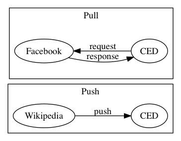

# Introduction {#introduction}

Crossref Event Data (CED) is a service for collecting and distributing the events that occur around scholarly research objects. It concerns primarily articles in Crossref and datasets in DataCite that have a DOI. For the purposes of this document, 'Research Object' will be used to mean any item in Crossref (including articles, books, conference proceedings, etc) or in DataCite (including datasets etc) that has a DOI. 'Research object' is used to mean any item that has a DOI.

This data will be available via an API, where users can browse, integrate it with other software or conduct experiments.

TODO

- approx roadmap

## Principles and Motivation

TODO

- altmetrics emerging field
- openness of all processes and data
- aggregators - not doing that
- audience
- full details reference blogs/ site

## NISO

TODO

 - CED close participation
 - meet all recommendations
 - whole document answers NISO complicance questions
 - specific points answered in the appendix

## What is an Event? {#what-is-event}

The world of Event Data is varied, and CED aims to capture data from as wide a range of sources as possible. An 'ideal' event can be described as

> an action that occurs that concerns a Research Object

However the types of events, and they way in which they can be collected, are varied. Here are some examples:

- someone tweeted mentioning a DOI
- someone liked an article on Facebook
- a reference to an article was added to Wikipedia using its DOI

Just as the events are varied, so too are the methods we can use to collect them. We can capture and represent an individual tweet but Facebook only gives us access to a count of how many times a DOI has been liked. Wikipedia also poses an interesting challenge because a reference can be added or removed, so depending when you query the system, a reference may or may not exist.

There are also different types of data consumers who have different requirements:

- an author wants to know if article was mentioned on twitter
- a bibliometrician wants to know what time of day people tweet about DOIs
- a Wikipedian wants to know how often DOI references are removed from articles

For this reason, we represent Events in two layers of detail: Relations and Deposits.

### Relations

A Relation is a single piece of information that concerns a research object. Examples include:

- `twitter.com/CrossrefOrg/status/517313741491552256` mentioned `doi.org/10.5555/12345678` on 12th November 2014.
- On Facebook, the DOI `doi.org/10.1016/0300-9629(73)90490-8` was liked 5 times as of 25 November 2016.
- `en.wikipedia.org/wiki/Fish` references `doi.org/10.1007%2Fs003600050092` as of 24 September 2015.

These relations resemble triples, but include a date stamp and an optional count. For some sources, such as Twitter, they represent individual events that happened. For some sources, such as Facebook, they represent a count of events without any further detail because that is what is available. For some sources, such as Wikipedia, they represent the most recent state.

### Deposits

Relations aren't able to capture all activity. A Deposit is a single data point that records when CED became aware of new information. Examples of Deposits are:

- On 12th November 2014, Twitter reported that tweet `twitter.com/CrossrefOrg/status/517313741491552256` was published and it mentioned `doi.org/10.5555/12345678`.
- On 26th November 2016, CED contacted Facebook on 25 November 2016, and Facebook reported that the `doi.org/10.1016/0300-9629(73)90490-8` currently had 5 likes.
- On 24th September 2015, Wikipedia reported that there was an edit to the article `en.wikipedia.org/wiki/Fish` in which a reference to `doi.org/10.1007%2Fs003600050092` was removed.

### Working with Events

For most tasks, Relations will be of use. They help you to answer questions like "when was this DOI tweeted?" or "is this DOI mentioned in Wikipedia?". The Relations API provides bulk access to these events. It allows users to retrieve all Relations, or to filter them to only retrieve relations of a certain type or from a certain source (e.g. Wikipedia).

When it is important to get more detail on what exactly occurred to produce a Relation, the Deposit API will provide it. For example, it can help you to answer questions like "was this DOI reference removed from Wikipedia repeatedly?". It can also answer questions like "when exactly in the past has CED queried Facebook about this DOI".

# Roadmap

Crossref Event Data is currently at MVP stage, which is a proof of concept with a limited number of sources. As we move toward a full release, more data sources, partners and methods for accessing data will be added.

See the [Sources](#sources) section for a list of currently available sources.

| Blogs & Reference Works | Social Bookmarks | Social Shares & Discussions | Links to Research Entities |
|-------------------------|------------------|-----------------------------|----------------------------|
| Research Blogging       | CiteULike        | Facebook                    | ORCiD                      |
| ScienceSeeker           | Mendeley         | Twitter                     | DataCite                   |
| Wikipedia               | Reddit           | Europe PMC                  | Database Citations         |
| Wordpress.com           |

TODO

 - API vs GUI in future
 - SLA

# Getting Data from the API

## Events, Deposits & Relations

As detailed in the [What is an Event](#what-is-an-event) section, Event Data is represented as Relations and Deposits. These are available on the Event Data API. The API is web-based and uses JSON so you can easily develop software to work with it or try it out in your browser.

At the time of writing, the following options are available:

### Deposit API

Available at `http://eventdata.crossref.org/api/deposits`

Query parameters:

- `message_type` - `create` or `delete`
- `source_token` - the source token ID of the service that pushed the data in (see [Source Tokens](#source-tokens))
- `state` - the state of the deposit: one of `waiting`, `working`, `failed`, `done`
- `page` - the page number

TODO

 - Swagger docs available at ...

### Relations API

Available at `http://eventdata.crossref.org/api/relations`

Query parameters:

- `work_id` - The ID of the work, e.g. `http://doi.org/10.5555/12345678`
- `work_ids` - Comma separated work IDs
- `relation_type_id` - Relation type, e.g. `cites`
- `source_id` - ID of the source, e.g. `wikipedia`
- `page` - Page number
- `recent` - Limit to relations created last x days
- `per_page` - Results per page (0-1000), defaults to 1000

TODO

 - Swagger docs available at ...
 
 

TODO

- example query
- example response
- doesn't contain all deposits - see [Availability](#availability)

## Availability {#availability}

All of the Relations and Deposits data is available to everyone. We will make every effort to ensure that the Relations and Deposit APIs are available. As we are providing this as a free-to-access service, we cannot guarantee availability and high demand may produce occasional fluctuations in service. At some point in the future we will introduce a paid-for Sevice Level Agreement (SLA), which will provide agreements about the availability of the service. They will provide exatly the same data.

All Relations in CED will be available via the Relations API, and once there is a Relation in CED, it will always be available in its most up-to-date form on the API unless it is deleted. For practical reasons due to the high volume of data, the Deposits are *not* guaranteed to be available on the Deposits API forever. Deposits will be archived to the deposit log after a certain period of time so data will never be lost or become unavailable.

The exact period of time before Deposits are archived to the Deposit Log are to be determined, based on real-world observations.

## Deleted data

Relations can be deleted. For example, when a reference from a Wikipedia article to a DOI is removed, that reference no longer exists. CED aims to always have the most up-to-date state as far as possible.

When a Relation is deleted, it will be because of a particular Deposit which included an instruction to delete it. All Deposit events are retained in the Deposit API and log, so no information is lost. If you are interested in, for example, Wikipedia deletions, can find every addition and deletion of a reference in the Deposits.

## Using the API

The API is available via HTTP. You can try it out in your browser or easily integrate it with your software. If you're using Chrome, we suggest you use JSONView (available for [Chrome](https://chrome.google.com/webstore/detail/jsonview/chklaanhfefbnpoihckbnefhakgolnmc) and [Firefox](https://addons.mozilla.org/en-us/firefox/addon/jsonview/)) to make it easier to read the output.

TODO

- deposits API URL
- relations API URL
- filtered deposits
- filtered relations

# Scope {#scope}	

TODO

- mainly interested in works that have DOIs
- some places the Research Object is expressed as a DOI, sometimes the landing page
- Crossref Event Data is concerned with capturing DOIs. Other URLs reversal.
- for Reserach Objects in Crossref and DataCite that have DOIs
- DOIs from other DOI Registration Agencies may be picked up

## DOIs vs Landing Pages {#landing-pages}

TODO

- all Research Objects we are interested in have DOIs
- Wikipedia use use DOIs a large amount
- social media use landing pages not DOIs
- in tests, landing page far higher use than DOIs in twitter
- need to track research objects regardless of how discussed
- DOI landing pages have redirects
- CED captures all DOIs within scope but not every landing page
- service available to try out plus docs 

### Methodology

TODO

- how are domains collected / filtered
- list methods

### Limitations

TODO

- does not hit all landing pages, but nearly all known ones
- not all landing pages can be followed
- not possible to reverse all URLs
- some publishers prevent it
- show data for proportion of tweets collected
- domains from sample of DOIs per publisher

### Auditability 

TODO

- snapshots freely available, provide details
- versioning policy
- contents of snapshot
- source code available
- correlation to deposits
- see sources for their own audit log format

## Internal Research Object list

TODO

- doesn't store all DOIs
- used for pull sources, see Selection of DOIs
- works added over time
- have timestamp so can see first time CED became aware of DOI for query§

# Audit & Reproducibility {#audit-reproducibility}

TODO
 - Crossref Event Data is completely transparent
 - Provide Relations, Deposits and Audit Logs
 - Recreate Relations from Deposits
 - Recreate Deposits from 
 

## Three levels of data

TODO

- relations
- deposits
- audit logs

#### Deposits 

TODO

- evidence for deposits

#### Per source audit

If you want access to the audit logs for given sources, please contact Crossref. For contractual reasons, access to some data is subject to restrictions.

TODO

- limitations e.g. API keys, requests, removing sensitive info
- not available at MVP technical challenges

## DOI Reversal service

TODO

- see [DOIs vs Landing Pages](#landing-pages)

### Known research objects

TODO

- timestamp avilable for all works useful for knowing when a DOI might have first been queried against.

## Software

All the software involved in running Crossref Event Data is open source and available to the public. Crossref will publish a detailed log of every piece of software that is running at what version and update it when the new versions are deployed. This will allow auditors to know precisely which combinations of software were running at a given point in time.

# Sources {#sources}

The following Event Data Sources are available:

- Wikipedia
- Facebook
- Twitter
- DataCite Related
- Crossref Related

Full details of each source are provided below.

## Push vs Pull {#push-vs-pull}

Every Source operates by communicating with an external service via its API to retrieve information. Data sources are divided into those where the external service is able to send data directly to CED ('Push Sources') and those that require CED to initiate a request ('Pull Sources'). 

Pull sources, for example Facebook, provide some kind of interface that CED must go out and query. Most sources require one request to be made for each DOI we are interested in. Because of this, the data that we have for a pull source is only as recent as the last time we checked against it.

Because of techincal limitations like bandwidth, external organisations imposing rate limits on their APIs, and because there are around 100 million DOIs in existence, we cannot check every DOI against every Pull Source and we are limited in how often we can make queries.

CED will aim to update data from pull sources as often as possible, but this will fluctuate depending on real-world observations.

Push sources, for example Wikipedia, are able to send data directly to CED. This means that there are no limitations on the selection of DOIs (a Push source can send data about any DOI at any time) and it means that the data can be much fresher. Some push sources send data live as it is happening (e.g. Wikipedia), although it is up to the push source how often it pushes data. Some push sources may push data in batches. See the documentation for each source for details.

## Selection of DOIs for Pull Sources {#selection-of-dois}

Pull Sources work by making a query against an external service for a given DOI. To do this, it maintains an internal list of DOIs. As it's not practical to store every single extant DOI, CED only stores DOIs that it thinks are likely to have event data. This means that some events may not be captured because CED doesn't know about, and therefore can't query for, the DOI. It also means that even if there is some event data for a given Research Object, it only goes as far back as the time when CED became aware of it.

Every time CED learns about a new DOI, for example via a push source, it is placed on the list. The current mechanism is to rely on DOIs that enter via push sources.

The [Scope](#scope) section gives full details.

## Sources, Agents and Source tokens

TODO

 - describe agents vs sources
 - see [appendix](#source-tokens-appendix) for list 

## List of sources

### Datacite Related

Links from DataCite DOIs to Crossref DOIs. These are article citations made by dataset publishers that indicate in the metadata for a dataset that the dataset is linked to a Crossref DOI, via DataCite.

#### What events look like

#### How to use it

#### Provenance

TODO

- data sent from DataCite
- depositors from datacite

#### Methodology

#### Coverage

#### Freshness

DataCite will push data on a schedule. 

TODO

 - approx schedule

#### Audit & Reproducibility

#### Limtations, Quirks & Failure Cases

#### Further information

### Crossref Related

TODO

- Links from Crossref DOIs to DataCite DOIs. These are dataset citations made by publishers that indicate when the metadata for an article cites a dataset via Crossref.

#### What events look like

#### How to use it

#### Provenance

TODO

- Data supplied by Crossref
- supplied to crossref by publishers
- date corresponds to most recent index

#### Methodology

#### Coverage

#### Freshness

Crossref will push data into CED on a schedule.

TODO

- approx schedule?
- may run in bulk
- delay in metadata propagation

#### Audit & Reproducibility

#### Limtations, Quirks & Failure Cases

#### Further information

### Twitter {#twitter}

TODO

- Twitter mentions of Research Objects via DOI or article landing page. These are tweets that mention an article or dataset by its DOI, or via the landing page of the DOI.
- It applies to DOIs that belong to Crossref and DataCite.
- uses the DOI reverser to filter for domains of publisher landing pages and to attempt to reverse the URLs

#### What events look like

#### How to use it

#### Provenance

The data are supplied by Twitter and filtered by Crossref DET.

TODO

- uses DOI Reverser and domain list, see DOI reverser for details
- publisher domains and datacite member domains
- re-generated events with new data

#### Methodology

TODO

 - member domains list
 - filters
 - pipeline
 - audit logs
- title is body of tweet

#### Coverage

#### Freshness

TODO

- live stream, processed
- re-generation of data based on updated date stamps 

#### Audit & Reproducibility

TODO

- see DOI reverser for details on reproducibility
- all the audit info of DOI reversal, see DOI Reversal
- uses latest domain list and software can be correlated against events
- re-generated events 
- audit log contians all input events that match the initial filter
- identify which tweets came from DOI vs member domain by looking at text of tweet
- will publish date-stamped domain lists when new releases
- will store audit logs for all input events that match input filters

#### Limtations, Quirks & Failure Cases

TODO

- disconnection should be handled, so there should be no missing data
- all the caveats of DOI reversal, see DOI Reversal
- as long as domain was on domain list, matches can be improved
- uses latest domain list and software, if domains are missing at that time , no recourse
- all DOIs but not all landing pages
- landing pages taken from Crossref and DataCite
- all the limitations of the DOI Reversal service see [DOI Reversal](#doi-reversal)

#### Further information

### Facebook

Number of “shares,” “likes” and “comments” for a given DOI, as retrieved from the Facebook API.

TODO  - old developer account, maybe not all data types available

#### What events look like

TODO

 - likes, shares etc most recent

#### How to use it

TODO

 - likes, shares, etc most recent
 - useful to look at Deposits to get samples over time

#### Provenance

#### Methodology

#### Coverage

The Facebook source works by fetching counts for a selection of DOIs that it knows about. Because of the limitations of the Facebook API it is impractical to attempt to fetch data for all DOIs. Therefore CED checks only for a subset of all DOIs.

TODO selection of DOIs

#### Freshness

CED will fetch data for each DOI it knows about

The Facebook agent fetches DOIs on a schedule, currently twice a day at 06:00 and 18:00. Depending on the number of DOIs and response times it may not be possible to maintain this level. 

#### Audit & Reproducibility

TODO

 - plan to store API responses in audit log when service is launched

#### Limtations, Quirks & Failure Cases

TODO

 - only as good as most recent sample
 - data can be missing if sample didn't happen
 - rate of update variable, no committment
 - only DOIs we know about see scope
 - DOIs may be added, missing data doesn't mean no data
 - depends on Facebook API availability and rate limiting
 - Facebook has changed data schema before, may reduce amount of data in future

#### Further information

The Facebook source is part of the Lagotto software. Full technical details of the Facebook source are available on [the Lagotto documentation](http://www.lagotto.io/docs/facebook/).

### Wikipedia {#sources-wikipedia}

Edits taken from all known Wikipedia projects (`*.wikipedia.org`). This excludes Wikibooks, Wikiversity, various beta products for various technical reasons (availability and stability of upstream APIs, known formats etc).

- Wikipedia DOI citations and uncitations. These are edits to Wikipedia pages that mention a DOI directly, or edits that remove such mentions. The data are supplied by Wikipedia and filtered by Crossref DET.

#### What events look like

TODO

- Canonical URL  See the [Introduction](#sources-wikipedia)

#### How to use it

#### Provenance

#### Methodology

#### Coverage

#### Freshness

#### Audit & Reproducibility

An input trigger event corresponds to a change in any Wikipedia property. Because there is a very high volume of edits (up to 2 million per day) it is impractical to store triggers for which no DOIs were found. When an trigger does correspond to an event because a DOI was added or removed (50 thousand triggers per day), it is stored. When a trigger is stored it is given a UUID. Because an edit to a Wikipedia page (which would be treated as one trigger) can introduce more than one DOI reference, every trigger may correspond to one or more events. 

A monthly audit log of triggers is stored and may be available to users to wish to audit Wikipedia events. Each month's logs contain a log of events that correlate the trigger id, the event id and the relevant Wikipedia information:

 - `input-event-id`: trigger UUID, e.g. `c0eb1c46-6a59-49c9-926b-a10667ddd9de`
 - `event-id`: event UUID (available on Deposits data) `646c0a88-1905-47d8-a21f-6a86fbb384db`
 - `server-name`: Wikipedia server, e.g. `en.wikipedia.org`
 - `title`: article title, e.g. `Fish`
 - timestamp of edit event
 - old revision ID within Wikipedia, e.g. `1000`
 - new revision ID within Wikipedia, e.g. `1001`
 - action, one of `add` or `remove`
 - DOI
 
Example: 

    {"event-id":"a6fc8282-6581-4255-9e45-cd85d927ef91",
     "old-revision":33357537,
     "new-revision":33554607,
     "input-event-id":"6177d950-65e7-48a5-875f-3924a2d322fa",
     "title":"Mount Stanley",
     "url":"https://sv.wikipedia.org/wiki/Mount_Stanley",
     "dois-added": ["10.5194/hess-11-1633-2007"],
	 "dois-removed": [],
     "server-name":"sv.wikipedia.org"}
 
Using this data it is possible to fetch the page versions and compare cited DOIs.

#### Limtations, Quirks & Failure Cases

##### Recent Change Stream disconnection
The Recent Changes stream connection can be dropped due to network errors or server errors at either side. The client will attempt to reconnect immediately, but there can be up to 1 minute’s downtime.
Events that occur while the Recent Changes Stream is disconnected cannot be recovered.

Sometimes

https://phabricator.wikimedia.org/T130024

##### RESTBase API
Pages are fetched using wikimedia’s RESTBase API, after a minute’s wait to allow propagation. If they are not available on the API then they cannot be fetched. Because of the high volume of data coming through it is not possible to retry. 
Page revisions that take more than one minute to propagate through Wikipedia’s internal systems may not be captured.

##### Repeated delivery

Will have same ID. When viewing events, should make no difference. When viewing deposits, bear this in mind.

##### Inability to recognise DOI

URL vs text, reference section

##### Completeness of audit data

Because not all the audit data is being stored 

#### DOIs and templates

TODO

snippets don't always include DOIs, look at HTML not wikitext

#### Edit wars

TODO

#### Further information

### Other Push sources

TODO

- Data supplied by other providers. We allow data providers to supply us with individual events concerning DOIs. We are working with a prominent player in the scholarly space. Every event, such as “this DOI was annotated” is recorded. The data are sent directly from the provider.

#### What events look like

#### How to use it

#### Provenance

#### Methodology

#### Coverage

#### Freshness

Depending upon the providers, these can be received as a live stream or sent in batches.

#### Audit & Reproducibility

#### Limtations, Quirks & Failure Cases

# Pushing data into Crossref Event Data

## Push API

If organisations with Event Data wish to contribute to CED they can use the Deposit API to push data in. This accepts deposits in JSON format that represent relations in *subject verb object* format. To push data, the organisation should obtain an API key by contacting Crossref support.

TODO

- full swagger docs

## Sandbox and Staging

Crossref provides two test instances: Sandbox and Staging.

TODO

 - use of sandbox
 - use of staging
 - don't trust the data
 - may be service interruptions
 - contact us if you want to try stuff out

# Appendix: Software

Crossref Event Data uses a collection of software. It is all open source. 

## Lagotto

[http://lagotto.io]()

Lagotto is central to Crossref Event Data, and it runs at `eventdata.crossref.org`. It accepts events through the Deposit Push API and serves them up via the Relations and Deposit API. It also hosts all of the pull agents. Lagotto has extensive documentation, which can provide further detailed information the pull sources and interfaces, available on the [Lagotto site](http://lagotto.io).

Maintained jointly by DataCite and Crossref, operated by Crossref.

TODO

- where it runs

## Baleen-Wikipedia

[http://github.com/crossref/baleen-wikipedia]()

The adaptor that connects to the Wikipedia live Recent Changes event stream calculates events.

Maintained and operated by Crossref.

TODO

- what it does
- where it runs

## Baleen-Twitter

[http://github.com/crossref/baleen-twitter]()

The adaptor that connects to the a Twitter live stream and calculates events.

Maintained and operated by Crossref.

TODO

- what it does
- where it runs
- docs

## DOI Destinations

[http://github.com/crossref/doi-destinations]()

DOI Reversal service - see {#landing-pages}

Maintained and operated by Crossref.

TODO

- where it runs
- docs

# Appendix: Source tokens {#source-tokens-appendix}

TODO

 - see source-tokens for explanation of push vs pull
 - list source tokens
 - see http://eventdata.crossref.org/api/agents but caveats

# Appendix: NISO Altmetrics Data Quality Code of Conduct 

NISO provides an *Altmetrics Data Quality Code of Conduct* `NISO RP-25-201X-3`. Crossref participated in the development of this Code of Conduct. Below are responses to each of the recommendations in the Code of Conduct as of 17th March (draft).

Because these principles are designed into CED from the start, responses to the CoC questions make references to this entire manual.

#### 1: List all available data and metrics (providers and aggregators).

T1

See the [list of sources](#sources).

#### 2: Provide a clear definition of each metric.

A1

Crossref Crossref Event Data reports raw events, not metrics. The following events are provided:

- Links from Crossref DOIs to DataCite DOIs. Crossref is the central linking hub for scholarly communications. Publishers deposit metadata about articles as they are published. This includes links to datasets via DataCite.
- Links from DataCite DOIs to Crossref DOIs. Researchers deposit scholarly research objects for citation to DataCite.

Researchers deposit datasets and provide links to scholarly works via Crossref DOIs.

- Twitter DOI mentions. People discuss scholarly works via their DOIs, or the landing pages to which those DOIs resolve.

Crossref works with the Twitter data source, filtering Crossref and DataCite DOIs and corresponding landing pages.

- Wikipedia DOI citations and uncitations. Wikipedia pages are edited on a constant basis. A page can reference a DOI, and an edit to a page can introduce or remove a link to a DOI.

Crossref tracks when these events happen and records when a DOI is added or removed from a page, the DOI, and the page and revision numbers.

- Data supplied by other providers. Providers are able to push events, such as a DOI is annotation or download, into the Crossref Event Data service. The content of the event is dependent on the type of source. Crossref Event Data will make the event available verbatim. Events are supplied by the party that generated them.
- Facebook. Facebook Graph API allows Crossref Event Data to query for every DOI it knows about and record how many times a DOI was shared, liked, and commented on. Each time this data are collected is treated as an event.

#### 3: Describe the method(s) by which data are generated or collected and how data are maintained over time.

T1, T2, R1

Links from Crossref DOIs to DataCite DOIs. CrossRef identifies deposits and updates Crossref Event Data when it sees a DataCite DOI cited. This will happen in bulk for historical data, and will then be completed live as new deposits are made.

- Links from DataCite DOIs to Crossref DOIs. DataCite identifies deposits and updates Crossref Event Data when it sees a Crossref DOI cited. This will happen in bulk for historical data, and then will be done live as new deposits are made.
- Twitter DOI mentions. Crossref Crossref Event Data subscribes to the Twitter firehose, filtering it by Crossref and DataCite DOIs and those domains that DOIs resolve to. It stores all tweets that mention DOIs. For tweets that mention article or dataset landing pages, Crossref Event Data will attempt to identify the corresponding DOI and record that link (including both the DOI and the landing page URL). Not all landing pages URLs can be mapped to DOIs, but if a new technique enables a previously unknown mapping for a historical tweet, this event will be raised. The firehose is a live stream.
- Wikipedia DOI citations and uncitations. Crossref Crossref Event Data subscribes to the Wikipedia live stream of edits. For every edit that is made to any Wikipedia article, Crossref Event Data will analyze the content of the edit and look for DOIs having been added or removed. An event will be recorded for either the adding or removal of a DOI in a Wikipedia page. The edit stream is live and produces a live stream of events.
- Data provided by other providers. Crossref Crossref Event Data provides a “Push API” that enables data sources to push data into Crossref Event Data.

Providers can push data in batches or live. This is a generic capability, but allows for significant players in the scholarly space to publish DOI event data.

- Facebook: The Facebook API is queried for every DOI that belongs to Crossref or DataCite. The results are stored directly. The Facebook API is queried periodically. There are no guarantees about how often the Facebook API is queried as this depends on practical issues of scalability.

#### 4: Describe all known limitations of the data.

A3

Pull sources are limited to the selection of DOIs, see the [Sources](#sources) section for details.

- Links from Crossref DOIs to DataCite DOIs. Publishers must provide data. Crossref has around 5,000 publisher members and there are some variabilities among them.
- Links from DataCite DOIs to Crossref DOIs. Researchers must provide data to DataCite.
- Twitter DOI mentions. All DOIs in tweets can be reliably identified. In the case of landing pages, Crossref Crossref Event Data will make a best effort to resolve the landing pages, but there is no 100 percent reliable way to do this.
- Wikipedia DOI citations and uncitations. The Wikipedia live stream or supporting infrastructure may become unavailable. If this happens, those events will be missed.
- Data provided by other providers. The content of pushed data are the responsibility of those pushing the data. However, as they are the source, the data they do push can be considered to be canonical and of the best available quality.
- Facebook. As Crossref Crossref Event Data will be querying the Facebook API for a large number of DOIs, the period between updates is entirely dependent on practical scaling issues. Crossref Event Data may prioritize fetching data for DOIs that are more likely to have activity.

#### 5: Provide a documented audit trail of how and when data generation and collection methods change over time and list all known effects of these changes. Documentation should note whether changes were applied historically or only from change date forward.

R1, R2, R3

Events data are passed directly through. We provide no metrics.

All events have a timestamps for when they occurred and when they were generated or collected. Thus the infrastructure used to generate and collect events can be matched to the timestamp.

The Lagotto software is open source, so date stamps can be correlated to the version of the software that was running.

#### 6: Describe how data are aggregated.

T2

Events are stored individually and returned individually. Crossref Event Data will collect data and make it available without aggregation.

#### 7: Detail how often data are updated.

T3 Crossref Event Data provides an API to allow users to get data at any point. Data will be made available on the API as soon as possible after it is inserted into Crossref Event Data. See the individual [Sources](#sources) for details on data freshness.

#### 8: Describe how data can be accessed.

T4

All data will be freely available via the Crossref Event Data API. The raw data will be the primary way of interacting with Crossref Event Data. For a fee, we will also provide an SLA (service-level agreement) that will guarantee consistency of service (guaranteed response times to API calls).

The data will be identical to the free version, however.

#### 9: Confirm that data provided to different data aggregators and users at the same time are identical and, if not, how and why they differ.

R4

Crossref Event Data provides an API, which will allow users to make queries against DOIs to retrieve events.

Crossref Event Data also provides an SLA version of the API. This will have identical data, but we make guarantees of response times.

There will be a single API for all data, which is open. Using the SLA version of the API provides identical data.

#### 10: Confirm that all retrieval methods lead to the same data and, if not, how and why they differ.

All retrieval methods produce the same data. There is a single API, although there are service level agreements which guarantee response times.

#### 11: Describe the data-quality monitoring process.

T5, A2

The main failure mode will be service interruptions, meaning data sources becoming unavailable. These will be monitored per source to ensure that there is a constant stream of data. For Crossref Event Data, quality means consistency not, e.g., detection of gaming.

TODO: outages reporting

#### 12: Provide a process by which data can be independently verified (aggregators only).

R5

All Relations and data and the Deposits by which the data was generated will be freely available. Audit data will be available to selected parties on request (see [Audit and Reproducibility](#audit-reproducibility)).

#### 13: Provide a process for reporting and correcting data or metrics that are suspected to be inaccurate.

A2

Crossref support will be able to handle requests. We can attempt to reprocess raw data to re-generate events. We can back-fill missing events with appropriate date-stamps. As we are not aggregating events into metrics or scores, we will not provide scores which might later need adjustment.

TODO: Reporting outages?

# FAQ

TODO

 - check over all of these

Does CED collect data for all DOIs in existence?
 : CED is able to accept data for any DOI but does not store every DOI in its internal list because we do not expect there to be Event Data for every DOI. For this reason, Pull Sources do not collect full data for every DOI. See [Selection of DOIs](#selection-of-dois).
 
Which Registration Agencies' DOIs does CED use?
 : CED is is a joint venture by Crossref and DataCite. It is able to collect DOIs from any DOI Registration Agency (RA), and most sources don't check which RA a DOI belongs to. So in theory, some MEDRA DOIs might end up being deposited. However, some sources (such as [Twitter](#twitter)) target only Crossref and DataCite DOIs. Check the individual sources for full details (see [Sources](#sources)).

How long are Deposits available?
 : Deposits may be archived and removed from the API after a period of time. Deposits will never be deleted (unless in execptional circumstances) and will always be available via the deposit log. See [Availability](#availability).
 
What is an event?
 : TODO

What format does the API data come in?
 : All APIs use JSON format

Do I have to pay for the data?
 : No, the public data will be free. The clearinghouse will be free to access and pull data from for both commercial and noncommercial users. However for those users who enjoy an optimum level of service, will will also offer a paid-for SLA agreement to ensure agreed service-level standards. 

You have a Deposit API and a Relation API. What is the difference?
 : Before the MVP Technical blog post, we won’t have released info about these two items. When will the interviews occur? Also not sure about the latter term, Reflection API.

Will the data be auditable?
 : Yes. Based on our auditability guidelines, we will provide authorised access to a separate storage location for the purposes of obtaining data evidence for audits.  

Where will you store the data?
 : The Event Data collection of deposit data will be held in both short and long-term storage and will be accessible to the public via our deposit API or the Crossref Metadata Search page.

Can I use the data to feed into my commercial tool? 
 : Yes. We do not clean or aggregate the data we collect so that any commercial vendor has the opportunity to do this themselves in order to use the data in the way which best suits their commercial needs.  

Can you guarantee coverage of events across the sources?
 : Comment from Jennifer: “guarantees” are very tricky. we’re going to need to get our lawyer, Lois, to provide wording surrounding this later on before launch. Let’s leave this for now.

Can you guarantee speed of accessing event data?
 : TODO

Is your code base open source?
 : Yes, we use the open source Lagotto code base. 

When will Event Data be launched?
 : The MVP will be launch at the end of March, along with a Sandbox testing environment for interested users to test the pull and push sources available at that point (facebook and Wikipedia). We will release the full clearinghouse around July/August 2016 and then the SLA service in November 2016. 

# Glossary

Deposit Log
  : Storage for old Deposit entries. After a certain period of time, Deposits will be removed from the Deposit API and moved to the Deposit Log.

Push source
  : A source of Event Data, e.g. Wikipedia that pushes data directly into CED. See [Push vs Pull](#push-vs-pull)
  
Pull source
  : A source of Event Data, e.g. Facebook for which CED needs to connect and pull data out. See [Push vs Pull](#push-vs-pull)
 
Deposit API
  : TODO
  
Deposit Push API
  : TODO
  
Deposit
  : TODO
  
Relation
  : TODO

Research Object
 : TODO see [Introduction](#introduction)

Work
 : TODO see [Introduction](#introduction)

UUID
  : universally unique identifier. Looks like `c0eb1c46-6a59-49c9-926b-a10667ddd9de`.
  
External trigger
  : an event that occurred externally, e.g. an edit to a Wikipedia page or a tweet. An external trigger may correspond to several input events, e.g. a single edit on a Wikipedia page may introduce several DOI references, causing multiple events.
    
Event UUID
  : a UUID that corresponds to an event within Crossref Event Data. 